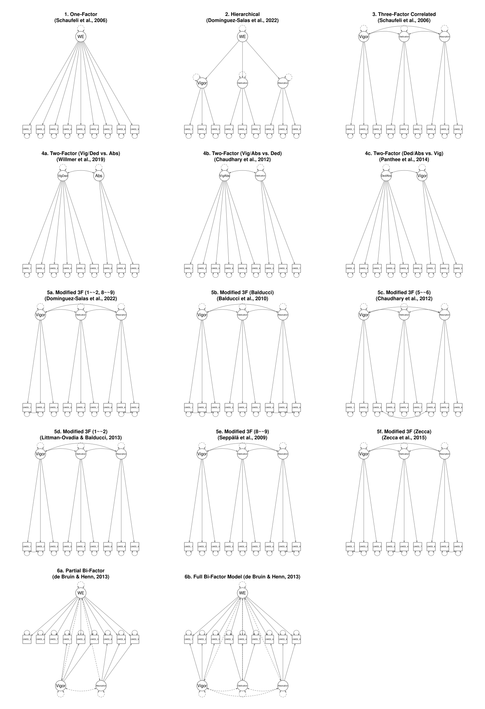
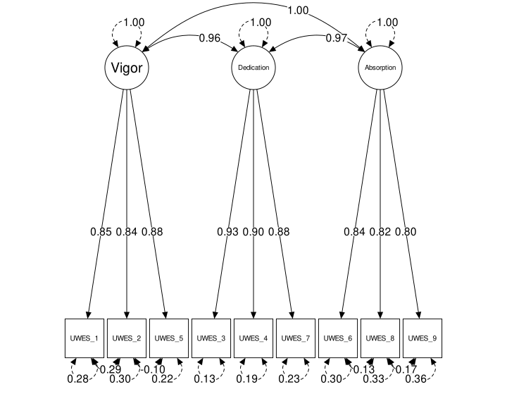

```{r setup, include = FALSE}
library("papaja")
r_refs("r-references.bib")
```

```{r analysis-preferences}
# Seed for random number generation
set.seed(87257413)
knitr::opts_chunk$set(cache.extra = knitr::rand_seed)
```

```{r loading libraries, include=FALSE}
packages=c("psych","dplyr","lavaan","base","foreign","Routliers","MVN","parameters","cocor","insight", "EFA.MRFA","RGenData","semPlot","psycho","apa","corx","effectsize","qwraps2","finalfit","ggstatsplot","dunn.test","devtools","rticles","ICC.Sample.Size","tidyverse","magrittr","osfr","expss","gtsummary","huxtable","equaltestMI","haven","rcompanion","ufs","semTools","semPlot","insight","flextable","officer","officedown") 

# Install packages not yet installed
installed_packages <- packages %in% rownames(installed.packages())
if (any(installed_packages == FALSE)) {
  install.packages(packages[!installed_packages], repos = "https://cran.r-project.org/")
}
# Packages loading
invisible(lapply(packages, library, character.only = TRUE))
#________________________________________________________________________-
# instal MissMach currently not on the CRAN
miss.mach.url= "https://cran.r-project.org/src/contrib/Archive/MissMech/MissMech_1.0.2.tar.gz"
Miss.Pack=any(rownames(installed.packages()) == "MissMech")
if (any(Miss.Pack == FALSE)) {
  install.packages(miss.mach.url, repos=NULL, type="source")
}
library(MissMech)
#________________________________________________________________________-
# instal citr currently not on the CRAN
Miss.Pack=any(rownames(installed.packages()) == "citr")
if (any(Miss.Pack == FALSE)) {
  devtools::install_github("crsh/citr")
}
library("citr")
#________________________________________________________________________-
# install papaja currently not on the CRAN
Miss.Pack=any(rownames(installed.packages()) == "papaja")
if (any(Miss.Pack == FALSE)) {
  devtools::install_github("crsh/papaja")
}
library("papaja")
#________________________________________________________________________-
# install papaja currently not on the CRAN
Miss.Pack=any(rownames(installed.packages()) == "dynamic")
if (any(Miss.Pack == FALSE)) {
  devtools::install_local("Supplementary_materials/dynamic/")
}
library("dynamic")
#________________________________________________________________________-
# Function to check, install and load psychtoolbox package
install_and_load_psychtoolbox <- function() {
  external_lib <- "../perth_alexithymia_questionnaire_validation/Packages/"
  if (file.exists(external_lib) && "psychtoolbox" %in% list.files(external_lib)) {
    library("psychtoolbox", lib.loc = external_lib)
    cat("Loaded psychtoolbox from external library:", external_lib, "\n")
  } else {
    if ("psychtoolbox" %in% rownames(installed.packages())) {
      library("psychtoolbox")
      cat("Loaded psychtoolbox from default library\n")
    } else {
      cat("psychtoolbox not found. Installing from GitLab...\n")
      if (!"devtools" %in% rownames(installed.packages())) {
        install.packages("devtools")
      }
      library(devtools)
      devtools::install_gitlab("lukas.novak/psychtoolbox")
      library("psychtoolbox")
      cat("Successfully installed and loaded psychtoolbox\n")
    }
  }
}

# Run the function
install_and_load_psychtoolbox()

# Helper functions:
# Cache Dynamic Fit Index (DFI) Cutoffs for Categorical Multi-Factor CFA Models
source("/home/rstudio/uwes-validation//R/cache_dynamic.R")
source("/home/rstudio/uwes-validation//R/create_dynamic_table.R")

# Helper function to format Cohen's q
format_q <- function(q_value) {
  return(format(round(q_value, 2), nsmall = 2))
}
```

# Introduction

Based on theoretical assumptions and previous empirical evidence [@Chan_Ho_Ip_Wong_2020] we expected significant positive association between self-efficacy and UWES total score (Hypotheses x). 

\newpage

# Methods
  
```{r data load and variable recode, include=FALSE}
path_to_dat = paste0(getwd(),"/Data")
data.raw=readRDS(paste0(path_to_dat,"/UWES_study.Rds"))
#_______________________________________________________________________
# variable recode
data.rec = data.raw %>% 
  rename("Religiosity" = "Religiosity",
         "Work_position" = "work_position") %>% 
  mutate(across(tidyr::starts_with(c("BFI_E_2","BFI_E_5","BFI_E_7")), ~dplyr::recode(., 
                                                                       "1"= 5,
                                                                       "2"= 4,
                                                                       "3"= 3,
                                                                       "4"= 2,
                                                                       "5"= 1)),
           across(tidyr::starts_with(c("BFI_N_2","BFI_N_5","BFI_N_7")), ~dplyr::recode(., 
                                                                       "1"= 5,
                                                                       "2"= 4,
                                                                       "3"= 3,
                                                                       "4"= 2,
                                                                       "5"= 1)),
         across(starts_with(c("obtize_","hlth_","UWES_","BFI_","Age")), ~ as.numeric(.)), # this can be deleted if not used    
         DSES = rowMeans(across(starts_with("DSES_"))),
         GSES = rowSums(across(starts_with("GSES_"))),
         BFI_N = rowSums(across(starts_with("BFI_N_"))),
         BFI_E = rowSums(across(starts_with("BFI_E_"))),
  # rename(hlth_for_wom_pain_in_the_small_ = hlth_women_pain_in_small_etc) %>%  # this can be deleted if not used
  UWES = rowSums(across(starts_with("UWES_"))),
  UWES_V = rowSums(across(ends_with(c("UWES_1", "UWES_2", "UWES_5")))),
  UWES_D = rowSums(across(ends_with(c("UWES_3", "UWES_4", "UWES_7")))),
  UWES_A = rowSums(across(ends_with(c("UWES_6", "UWES_8", "UWES_9"))))) %>%                    
  mutate(Education = recode_factor(Education, 
                                   "Basic school" = "Basic school", 
                                   "Vocational school or non - maturity high school" = "Non graduation high school or lower",
                                   "High school" = "High school",
                                   "Higher vocational school" = "Higher vocational school or University",
                                   "University bachelor" = "Higher vocational school or University",
                                   "University master" = "Higher vocational school or University",
                                   "University Dr" = "Higher vocational school or University",
                                   "other: Ph.D." = "Higher vocational school or University"), 
                    Economical_status = recode_factor(Economical_status, 
                                            "Student" = "Without work",
                                            "Invalidy pensioner" = "Pensioner", 
                                            "Employed" = "Working",
                                            "Enterpreanuer" = "Working",
                                            "Not working" = "Without work",
                                            "Pensioner"="Pensioner",
                                            "Maternity leave"="Without work",
                                            "Without work" = "Without work",
                                            "In household" = "Without work",
                                            "other: invalidní duchod" = "Pensioner",
                                             .default = NA_character_),
         Religiosity = recode_factor(Religiosity,
                               "Yes, I am a member or church/rel.society" = "Yes, I am a member of church",
                               "Yes, but I am not a member of church/rel.society" = "Yes, but I am not a member of a church"),
         Work_position = recode_factor(Work_position,
                                       "Worker" = "Worker",
                                       "Professional worker" = "Professional worker",
                                       "Chief worker" = "Chief worker",
                                       "High rank worker" = "Chief worker"))

# filtering only those being working
data.work = data.rec %>% 
  filter(Economical_status == "Working")

# selecting only high quality respondents
data = data.work %>% 
  filter(low_q_res == "HQ") %>% 
  mutate_if(is.factor, droplevels)


# if not used the following can be deleted
#................................................................................
# data.vacc = data.vacc %>% 
#     mutate(hlth_depression_anxiety = case_when(
#     hlth_psych_anxiety == "1" | 
#     hlth_psych_depress == "1" ~ 1, 
#     TRUE ~ 0
#   ))

# summ of all deseases
# data.vacc = data.vacc %>% 
#   mutate(General_health = rowSums(across(starts_with(c("hlth_")))))
#................................................................................

# per.male_female.pa=table(data.pa$Gender)/length(data.pa$Gender) 
per.male_female.s1=table(data$Gender)/length(data$Gender) 
```

```{r outliers screening Sample 1, inconsistent responding detection, include=FALSE}
# calculating MAD 
out_MAD.1.dat=outliers_mad(data$UWES, b = 1.4826,threshold = 2.5, na.rm = T) 
```

```{r missing data analysis, include=FALSE}
MCAR.t=MissMech::TestMCARNormality(data = select(.data = data, ends_with(c("UWES",
                                                                           "BFI_A",
                                                                           "BFI_N",
                                                                           "DSES",
                                                                           "vyska",
                                                                           "vaha"))))
```

```{r multivariate normality, include=FALSE}
# MULTIVARIATE NORMALITY 
# UWES
mvn(data = select(.data = data, starts_with("UWES_")),
    mvnTest = "mardia", univariatePlot = "histogram")

# summary: normality in UWES can be rejected  
```

```{r multicollinearity check, include=FALSE}
# MULTICOLLINEARITY CHECK
# Extract UWES items for correlation matrix
uwes_items <- select(.data = data, matches("UWES_\\d"))

# Calculate polychoric correlation matrix (appropriate for ordinal data)
library(psych)
poly_cor <- polychoric(uwes_items)

# Check correlation matrix for high correlations (> 0.90)
high_cor <- which(abs(poly_cor$rho) > 0.90 & poly_cor$rho != 1, arr.ind = TRUE)

if(nrow(high_cor) > 0) {
  cat("High correlations (> 0.90) found between items:\n")
  for(i in 1:nrow(high_cor)) {
    item1 <- colnames(poly_cor$rho)[high_cor[i,1]]
    item2 <- colnames(poly_cor$rho)[high_cor[i,2]]
    cor_val <- round(poly_cor$rho[high_cor[i,1], high_cor[i,2]], 3)
    cat(paste(item1, "and", item2, ":", cor_val, "\n"))
  }
} else {
  cat("No extreme multicollinearity detected (all correlations < 0.90)\n")
}

# Alternative: Calculate VIF-like measure using determinant
det_cor <- det(poly_cor$rho)
cat(paste("Correlation matrix determinant:", round(det_cor, 4), "\n"))
cat("(Values close to 0 indicate multicollinearity issues)\n")
```

```{r Homoscedasticity_and_other_assumptions, include=FALSE}
# fake regression 
random=rchisq(nrow(data), 5) # generate random data
fake_regres=lm(random~., data= data %>% select(starts_with("UWES_"))) # run fake regression
# run diagnostics plots 
plot(fake_regres) 
# testing homogenity of variances
bp.t.1 = car::ncvTest(fake_regres) # homogeneity of variances can be rejected
# bp.t.1=lmtest::bptest(fake_regres) 
```

## Participants  
  From the survey (*n* = `r nrow(data.rec)`), we excluded participants being either without work (*n* = `r nrow(filter(data.rec, Economical_status == "Without work"))`), pensioners (*n* = `r nrow(filter(data.rec, Economical_status == "Pensioner"))`) or those who did not answer a question regarding economical status (*n* = `r sum(is.na(data.rec$Economical_status),na.rm = T)`). This resulted in `r nrow(data.work)` participants. To increase data quality, we removed subjects finishing the survey in a short period of time i.e. < 15 minutes (*n* = `r nrow(filter(data.rec, status == "SPEEDER"))`). The survey typically lasted > 30 minutes. We also excluded respondents answering discrepantly to quality check items (*n* = `r nrow(data.work)-nrow(data)-nrow(filter(data.rec, status == "SPEEDER"))`). These items included information about weight, height and age. Tolerance in these control questions was set on 2 kilograms, 2 centimeters, and 2 years respectively. After removal of these subjects, the final number of participants was `r nrow(data)` (Age: *M* = `r mean(data$Age, na.rm = T) %>% round(digits = 2)`, *SD* = `r sd(data$Age, na.rm = T) %>% round(digits = 2)`, Females: `r round(per.male_female.s1[["Female"]]*100,digits = 2)`%).   

## Measures

### Utrecht Work Engagement Scale (UWES)

```{r DSES rel, include=FALSE}
# DSES  
DSES.rel=ufs::scaleStructure(select(starts_with(c("DSES_")), .data = data), digits = 2, poly = TRUE, samples = 5000)
```

### Daily Spiritual Experience Scale (DSES)

  Internal consistency of the DSES was excellent: Cronbach's $\alpha$ = `r round(DSES.rel$intermediate$alpha.ordinal.ci$est,digits=2)` 95% CI[`r round(DSES.rel$intermediate$alpha.ordinal.ci$ci.lower,digits=2)` - `r round(DSES.rel$intermediate$alpha.ordinal.ci$ci.upper,digits=2)`] and McDonald's $\omega_t$ = `r round(DSES.rel$intermediate$omega.ordinal$est, digits=2 )` 95% CI[`r round(DSES.rel$intermediate[["omega.ordinal.ci"]]$ci.lower, digits = 2)` - `r round(DSES.rel$intermediate[["omega.ordinal.ci"]]$ci.upper, digits = 2)`].

```{r GSES rel, include=FALSE}
# GSES  
GSES.rel=ufs::scaleStructure(select(starts_with(c("GSES_")), .data = data), digits = 2, poly = TRUE, samples = 5000)
```

### General Self Efficacy Scale (GSES)

  Internal consistency of the GSES was excellent: Cronbach's $\alpha$ = `r round(GSES.rel$intermediate$alpha.ordinal.ci$est,digits=2)` 95% CI[`r round(GSES.rel$intermediate$alpha.ordinal.ci$ci.lower,digits=2)` - `r round(GSES.rel$intermediate$alpha.ordinal.ci$ci.upper,digits=2)`] and McDonald's $\omega_t$ = `r round(GSES.rel$intermediate$omega.ordinal$est, digits=2 )` 95% CI[`r round(GSES.rel$intermediate[["omega.ordinal.ci"]]$ci.lower, digits = 2)` - `r round(GSES.rel$intermediate[["omega.ordinal.ci"]]$ci.upper, digits = 2)`]. 

```{r BFI_N rel, include=FALSE}
# BFI_N  
BFI_N.rel=ufs::scaleStructure(select(starts_with(c("BFI_N_")), .data = data), digits = 2, poly = TRUE, samples = 5000)
```

### Big Five Inventory - Neuroticism subscale (BFI_N)

  Internal consistency of the BFI_N was good: Cronbach's $\alpha$ = `r round(BFI_N.rel$intermediate$alpha.ordinal.ci$est,digits=2)` 95% CI[`r round(BFI_N.rel$intermediate$alpha.ordinal.ci$ci.lower,digits=2)` - `r round(BFI_N.rel$intermediate$alpha.ordinal.ci$ci.upper,digits=2)`] and McDonald's $\omega_t$ = `r round(BFI_N.rel$intermediate$omega.ordinal$est, digits=2 )` 95% CI[`r round(BFI_N.rel$intermediate[["omega.ordinal.ci"]]$ci.lower, digits = 2)` - `r round(BFI_N.rel$intermediate[["omega.ordinal.ci"]]$ci.upper, digits = 2)`]. 

```{r BFI_E rel, include=FALSE}
# BFI_E  
BFI_E.rel=ufs::scaleStructure(select(starts_with(c("BFI_E_")), .data = data), digits = 2, poly = TRUE, samples = 5000)
```
### Big Five Inventory - Extraversion subscale (BFI_E)

  Internal consistency of the BFI_E was good: Cronbach's $\alpha$ = `r round(BFI_E.rel$intermediate$alpha.ordinal.ci$est,digits=2)` 95% CI[`r round(BFI_E.rel$intermediate$alpha.ordinal.ci$ci.lower,digits=2)` - `r round(BFI_E.rel$intermediate$alpha.ordinal.ci$ci.upper,digits=2)`] and McDonald's $\omega_t$ = `r round(BFI_E.rel$intermediate$omega.ordinal$est, digits=2 )` 95% CI[`r round(BFI_E.rel$intermediate[["omega.ordinal.ci"]]$ci.lower, digits = 2)` - `r round(BFI_E.rel$intermediate[["omega.ordinal.ci"]]$ci.upper, digits = 2)`]. 

## Data analysis
  Inspection of histograms and results of the Mardia test of multivariate skewness and kurtosis indicated that the normality assumption is violated in the UWES items. Moreover, examination of residual plots and result of the Breusch-Pagan test ($\chi^2$ = `r round(bp.t.1$ChiSquare,digits=2)`, *df* = `r bp.t.1$Df`, `r format_p(bp.t.1$p)`) suggested heteroscedasticity. Examination of the polychoric correlation matrix revealed no extreme multicollinearity among items, with all inter-item correlations below 0.90. Thus, methods not requiring parametric assumptions were used. The Little MCAR test provided an evidence that missing values are missing on random. Thus, as there was not a large number of missing values (*n* = `r nrow(filter(data, is.na(UWES_9)))`), incomplete cases were deleted listwise.
  
  The instrument's factor structure was investigated via Confirmatory Factor Analysis (CFA). A series of competing models were specified, reflecting those most prominent in the validation literature. For the full overview and model definitions see Figure 1 below. The analysis included the original correlated three-factor model (Vigor, Dedication, Absorption) and a unidimensional one-factor model (Schaufeli, Bakker, & Salanova, 2006). To account for the consistently high inter-factor correlations, a hierarchical model, with the three factors loading onto a single second-order Work Engagement factor, was also tested (Domínguez-Salas et al., 2022). Additionally, several alternative configurations were examined, including various two-factor solutions (e.g., Chaudhary, Rangnekar, & Barua, 2012), a partial and full bi-factor model (de Bruin & Henn, 2013), and modified three-factor models with correlated error terms (e.g., Simbula et al., 2013).
  
```{r printOfModelsFigure, message=FALSE, warning=FALSE, include=FALSE}
# Justin print long list of all models

# Check if we need to regenerate the plot
source_file <- "./R/sem_plot_all_models.R"
output_file <- "./Figures/Figure_1_All_CFA_Models_Final.svg"  # Adjust to your actual output filename

# Function to check if plot needs regeneration
needs_regeneration <- function(source_file, output_file) {
  # Check if output file exists
  if (!file.exists(output_file)) {
    return(TRUE)
  }
  
  # Check if source file is newer than output file
  source_mtime <- file.mtime(source_file)
  output_mtime <- file.mtime(output_file)
  
  return(source_mtime > output_mtime)
}

# Only run the expensive plotting code if needed
if (needs_regeneration(source_file, output_file)) {
  cat("Regenerating plot - source code has changed or output doesn't exist\n")
  source(source_file)
} else {
  cat("Skipping plot generation - no changes detected\n")
}
```
  
```{r TestedModels, include=FALSE}
op_section <- prop_section(type = "continuous")
close_section <- prop_section(
    page_size = page_size(orient = "landscape", width = 15, height = 13), 
    type = "continuous")
```

```{r}
block_section(op_section)
```

```{r figure-uwes-models, echo=FALSE, fig.cap="Confirmatory Factor Analysis Models for UWES-9. All 14 unique tested models are displayed with their respective factor structures and correlated errors where applicable.", fig.width=20, fig.height=14, dpi=300, out.width="100%", out.height="100%"}


```

```{r}
block_section(close_section)
```

  Kaiser-Meyer-Olkin (KMO) measure, together with the Bartlett test of sphericity, was applied to assess the factorability of the UWES data. Five indices were used to inspect model fit: 1) Mean Square Error of Approximation (RMSEA); 2) Standardised Root Mean Square Residual (SRMR); 3) chi-square test; 4) Comparative Fit index (CFI); and 5) Tucker-Lewis index (TLI). While these traditional fit indices are widely reported, their fixed cutoff values (e.g., RMSEA < .06, CFI > .95) have been criticized for poor generalizability, particularly because their performance is highly dependent on the specific characteristics of the model being tested (McNeish & Wolf, 2022). Therefore, to provide a more rigorous and accurate assessment of model fit, we adopted the Dynamic Fit Index (DFI) approach (McNeish & Wolf, 2021). This method generates customized fit index cutoffs tailored to the unique characteristics of each model, such as the number of factors, items, sample size, and the magnitude of factor loadings. Using Monte Carlo simulation, the DFI method generates a distribution of fit indices for the researchers' model under the assumption that it is correctly specified (Level-0) and compares it to distributions where the model contains a degree of hypothetical misspecification (e.g., Level-1, containing minor omitted cross-loadings). This process yields a direct, empirical benchmark (the Level-0 cutoff) representing the expected fit for a well-fitting model with the current data's characteristics. The Weighted Least Squares Mean and Variance adjusted (WLSMV) on the polychoric correlation matrix was used to fit CFA models.
  
  The invariance of a measurement was explored between males and females. Configural, metric, scalar, and strict invariance were supported if $\Delta$CFI was < 0.01 between invariance models. The scale reliability was measured by the McDonald’s $\omega$ and also by the Cronbach’s $\alpha$. In addition to these, model-based Composite Reliability (CR) was calculated to assess the internal consistency of each factor, with values > 0.70 indicating good reliability (Fornell & Larcker, 1981).
  
  Construct validity was evaluated in several ways. First, we explored internal convergent validity during CFA, which assessed the degree to which items of a specific factor are related. More specifically, this was tested using the Average Variance Extracted (AVE), with values > 0.50 considered acceptable (Fornell & Larcker, 1981). Next we assessed, internal discriminant validity, which evaluated whether the factors are statistically distinct. For this purpous, the Heterotrait-Monotrait Ratio of Correlations (HTMT) test was used. If values from this test do not reach 0.90 discriminant validity is supported (Henseler et al., 2015). In the further step, we tested onvergent and divergent validity externally i.e., via zero-order Spearman rank correlations with self-efficacy, neuroticism, and extraversion (convergent), and with spirituality (divergent). Relatedly, to provide a formal test of external discriminant validity, the magnitudes of the dependent correlations between the UWES subscales and these external criteria were compared using the z-test from Hittner, May, and Silver (2003). To quantify the magnitude of these differences, we calculated Cohen's q as an effect size. Cohen's q values are interpreted as follows: q  $\approx$ 0.10 indicates a small effect, q $\approx$ 0.30 a medium effect, and q  $\approx$ 0.50 a large effect.
  
  Due to the non-normal distribution of the data, an association between the chronic health illnesses, health risk behaviour and UWES was calculated using logistic regression. In the logistic models, outcome variable was presence of an individual chronic illness or practise of health risk behaviour. The UWES score was set as a predictor. Education and work position were covariates. Both crude and adjusted effect were estimated. The p-values were corrected by Bonferroni correction.         
  
  Comparisons between socio-demographic groups in the UWES total and subscale scores were performed using the Kruskal-Wallis test. Significant omnibus tests were followed by post-hoc analysis using the Games-Howell test for groups with unequal variances or Dunn’s test where variances were equal. To quantify the magnitude of effects, epsilon-squared ($\epsilon^2$) was reported for the overall Kruskal-Wallis test, while Cohen's *d* and the Rank-Biserial Correlation (*rbc*) were reported for the respective post-hoc comparisons. The interpretation of effect sizes followed established conventions: for epsilon-squared, values of 0.01, 0.06, and 0.14 are considered small, medium, and large effects, respectively. For Cohen's *d*, benchmarks of 0.2, 0.5, and 0.8 were used for small, medium, and large effects, and for the rank-biserial correlation, values of 0.1, 0.3, and 0.5 were used to interpret small, medium, and large effects. All statistical calculations were conducted in `r cite_r()`. Primary packages used for analysis included: *lavaan* [@R-lavaan], *papaja* [@R-papaja] *psych* [@R-psych], *usf* [@R-ufs].     
  
# Results

## Socio-demographic results

  Results of the Kruskal-Wallis test followed by the Games-Howell and the Dunn test revealed that there are significant differences in socio-demographic groups in the UWES total and subscale scores: professional workers had significantly higher scores in the UWES total, Dedication, and Absorption subscales as compared with workers. Similarly, managers reported higher UWES total scores and also higher Dedication, Absorption, and Vigor subscale scores compared with workers (see Table \@ref(tab:SocDemTabPrint)).In terms of education, individuals with a higher vocational school or university degree had a significantly higher total UWES score compared to those with non-graduation high school or lower education. For the Absorption subscale, the university-educated group scored significantly higher than both the non-graduation high school and the high school educated groups (Table \@ref(tab:SocDemTabPrint)). Furthermore, a significant difference was found based on family status, where individuals in a relationship reported a higher score on the Absorption subscale than those not in a relationship. There were no other significant differences between the tested socio-demographic groups.

```{r SocDemTableCreation, message=FALSE, warning=FALSE, include=FALSE, results='hide'}
# Define grouping and outcome variables
my_groups <- c("Gender", "Education", "Family_status", "Religiosity", "Work_position")
my_outcomes <- c("UWES", "UWES_D", "UWES_A", "UWES_V")

# Run the entire analysis with one command
soc_dem_tb <- mult.g.comp(
    df = data,
    groups = my_groups,
    outcome.var = my_outcomes,
    short_results = FALSE, # Set to FALSE to get detailed statistics (like in your old code)
    show_non_significant_results = FALSE 
) 

op_section <- prop_section(type = "continuous")
close_section <- prop_section(
    page_size = page_size(orient = "landscape", width = 19, height = 24), 
    type = "continuous")
```

```{r}
block_section(op_section)
```

```{r SocDemTabPrint, echo=FALSE, message=FALSE, warning=FALSE}
soc_dem_tb %>%  
  as_tibble() %>% 
  mutate_all(~(replace(., is.na(.), ""))) %>%
  as_huxtable(add_colnames = F) %>% 
  set_bottom_border(row = 1, value = 1) %>%  # the 1 here indicates the rownumber 
  set_font("times") %>% 
  set_font_size(10) %>% 
  apa_table(
    caption = "Descriptive Statistics and Group Comparisons for Utrecht Work Engagement Scale (UWES) Scores Across Socio-Demographic Variables",
    note = "M = Mean; SD = Standard Deviation; n = count. Group differences were assessed using the Kruskal-Wallis test, reported as the *H* statistic with its degrees of freedom (df), p-value, and epsilon-squared effect size. Significant omnibus tests were followed by pairwise post-hoc comparisons. For groups with unequal variances, the Games-Howell test is reported (t-statistic and Cohen's *d* effect size). For groups with equal variances, Dunn's test is reported (z-statistic and Rank-Biserial Correlation, *rbc*, effect size). UWES = Utrecht Work Engagement Scale total score; UWES_D = Dedication subscale; UWES_A = Absorption subscale; UWES_V = Vigor subscale.", span_text_columns = FALSE)
```

```{r}
block_section(close_section)
```

```{r Bartlett test and KMO, include=FALSE}
# POLYCHORIC CORELATION MATRIX
# UWES 
UWES.rep.poly = data %>% select(starts_with(c("UWES_1", "UWES_2", "UWES_5","UWES_3",
                                              "UWES_4", "UWES_7","UWES_6", "UWES_8", "UWES_9"))) %>% lavCor(ordered = T)
# BARTLETS TEST OF SPHERICITY:
bartlett.UWES=cortest.bartlett(UWES.rep.poly, diag = T, n=nrow(data)) #  Bartlett's test of sphericity 
# KMO
KMO(UWES.rep.poly) # 0.96
```

```{r CFA-UWES-three-fac, include=FALSE}
# three factor model 
three.fac.mod = "Vigor =~ UWES_1 + UWES_2 + UWES_5 
               Dedication =~ UWES_3 + UWES_4 + UWES_7
               Absorption =~ UWES_6 + UWES_8 + UWES_9"
# when "ordered" is set to "TRUE", than DWLS estimator is automatically used as "standard" in results. 
# "Robust" chisquare in results is referring to WLSMV estimator.
UWES.three.fac=sem(model = three.fac.mod, data = data, std.lv=T, ordered = T, estimator = "WLSMV")
three.fac.mod.sum=summary(UWES.three.fac,rsquare=T, standardized=T, fit.measures=T)
modificationindices(UWES.three.fac, sort. = T) # how can we improve our model
# inspection of correlation between residuals
# Large positive values indicate the model underpredicts the correlation; large negative values suggest overprediction of the correlation. Usually values |r>.1| are worth closer consideration.
resid(UWES.three.fac, "cor")

DFI_three_factor <- cache_dynamic(
  cache_dir  = "./Supplementary_materials/Data_generated_during_code_running", robust = TRUE,
  model = UWES.three.fac,
  estimator = "WLSMV",
  data = data
  )

```

```{r CFA_two_factor_model, include=FALSE}
# two factor model 
two.fac.mod="VigDeg =~ UWES_1 + UWES_2 + UWES_3 + UWES_4 + UWES_5 + UWES_7
             Abs =~  UWES_6 + UWES_8 + UWES_9"

#when "ordered" is set to "TRUE", than DWLS estimator is auto  matically used as "standard" in results. "Robust" chisquare in results is referring to WLSMV estimator.
UWES.two.fac=cfa(model = two.fac.mod, data = data, std.lv=T, ordered = T)
two.fac.mod.sum=summary(UWES.two.fac,rsquare=T, standardized=T, fit.measures=T)
parameterestimates(UWES.two.fac, standardized = T) # whill show standardized estimates and many other things
modificationindices(UWES.two.fac, sort. = T) # how can we improve our model
fitmeasures(UWES.two.fac) # chisq.scaled - robust one

# DFI
DFI_two_factor <- cache_dynamic(
  cache_dir  = "./Supplementary_materials/Data_generated_during_code_running", robust = TRUE,
  model = UWES.two.fac,
  data = data
  )

one.fac.mod.cor.er.UWES.resid=resid(UWES.two.fac, "cor")
dif.test.two.three.fac=lavaan::anova(UWES.three.fac,UWES.two.fac)

```

```{r CFA_one_factor_model, include=FALSE}
# one factor model 
one.fac.mod="WE =~ UWES_1 + UWES_2 + UWES_3 + UWES_4 + UWES_5 + UWES_6 + UWES_7 + UWES_8 + UWES_9"

#when "ordered" is set to "TRUE", than DWLS estimator is auto  matically used as "standard" in results. "Robust" chisquare in results is referring to WLSMV estimator.
UWES.one.fac=sem(model = one.fac.mod, data = data, std.lv=T, ordered = T)
one.fac.mod.sum=summary(UWES.one.fac,rsquare=T, standardized=T, fit.measures=T)
parameterestimates(UWES.one.fac, standardized = T) # whill show standardized estimates and many other things
modificationindices(UWES.one.fac, sort. = T) # how can we improve our model
fitmeasures(UWES.one.fac) # chisq.scaled - robust one

# DFI
DFI_one_factor <- cache_dynamic(
  cache_dir  = "./Supplementary_materials/Data_generated_during_code_running", robust = TRUE,
  model = UWES.one.fac,
  data = data
  )

one.fac.mod.cor.er.UWES.resid=resid(UWES.one.fac, "cor")
dif.test.one.three.fac=lavaan::anova(UWES.three.fac,UWES.one.fac)
```

```{r CFA_hierarchical_factor_model, include=FALSE}

# # Define the names of the ordered categorical variables
# ordered_vars <- c("UWES_1", "UWES_2", "UWES_3", "UWES_4", "UWES_5", 
#                   "UWES_6", "UWES_7", "UWES_8", "UWES_9")

# one factor model 
hier.fac.mod=" Dedication =~ UWES_3 + UWES_4 + UWES_7
               Absorption =~ UWES_6 + UWES_8 + UWES_9
               Vigor =~ UWES_1 + UWES_2 + UWES_5
               WE =~ Dedication + Absorption + Vigor"

#when "ordered" is set to "TRUE", than DWLS estimator is auto  matically used as "standard" in results. "Robust" chisquare in results is referring to WLSMV estimator.
UWES.hier.fac.hier=sem(model = hier.fac.mod, data = data, std.lv=T, ordered = T)
hier.fac.mod.sum=summary(UWES.hier.fac.hier,rsquare=T, standardized=T, fit.measures=T)
parameterestimates(UWES.hier.fac.hier, standardized = T) # whill show standardized estimates and many other things
modificationindices(UWES.hier.fac.hier, sort. = T) # how can we improve our model
fitmeasures(UWES.hier.fac.hier) # chisq.scaled - robust one

# DFI
DFI_hierarch_factor <- cache_dynamic(
  cache_dir  = "./Supplementary_materials/Data_generated_during_code_running", robust = TRUE,
  model = UWES.hier.fac.hier,
  data = data
  )

# one.fac.mod.cor.er.UWES.resid=resid(UWES.hier.fac.hier, "cor")
# dif.test.one.three.fac=lavaan::anova(UWES.three.fac,UWES.hier.fac.hier)
```

```{r CFA_partial_bi_factor_model_de_Bruin, eval=FALSE, include=FALSE}
# de Bruin, G. P., & Henn, C. M. (2013). Dimensionality of the 9-item Utrecht Work Engagement Scale (UWES–9). Psychological Reports, 112(3), 788–799. https://doi.org/10.2466/01.03.PR0.112.3.788-799

# Partial bi-factor model from de Bruin & Henn (2013). 
# A general factor (WE) influences all items. 
# Two specific group factors (Vigor and Absorption) influence their respective items.
# The Dedication items' variance is fully explained by the general factor.
# The general factor is specified to be uncorrelated with the group factors.

partial.bifac.mod.deBruin <- "
    WE =~ UWES_1 + UWES_2 + UWES_3 + UWES_4 + UWES_5 + UWES_6 + UWES_7 + UWES_8 + UWES_9
    Vigor =~ UWES_1 + UWES_2 + UWES_5
    Absorption =~ UWES_6 + UWES_8 + UWES_9
    
    # Specify factors are orthogonal (uncorrelated)
    WE ~~ 0*Vigor
    WE ~~ 0*Absorption
    Vigor ~~ 0*Absorption
"

# When "ordered" is set to "TRUE", the DWLS estimator is automatically used.
UWES.partial.bifac.deBruin <- sem(model = partial.bifac.mod.deBruin, data = data, std.lv = TRUE, ordered = TRUE)
partial.bifac.deBruin.sum <- summary(UWES.partial.bifac.deBruin, rsquare = TRUE, standardized = TRUE, fit.measures = TRUE)
parameterestimates(UWES.partial.bifac.deBruin, standardized = TRUE) # Will show standardized estimates and many other things
modificationindices(UWES.partial.bifac.deBruin, sort. = TRUE) # How can we improve our model
fitmeasures(UWES.partial.bifac.deBruin) # chisq.scaled - robust one

# DFI
DFI_partial_bifactor_deBruin <- cache_dynamic(
  cache_dir  = "./Supplementary_materials/Data_generated_during_code_running", robust = TRUE,
  model = UWES.partial.bifac.deBruin,
  data = data
)

partial.bifac.deBruin.resid <- resid(UWES.partial.bifac.deBruin, "cor")
# Example of model comparison if needed, e.g., comparing to the three-factor model
# dif.test.partial.bifac.three.fac <- lavaan::anova(UWES.three.fac, UWES.partial.bifac.deBruin)
```

```{r bi_factor_model, eval=FALSE, include=FALSE}
bifac.mod <- "
    WE =~ UWES_1 + UWES_2 + UWES_3 + UWES_4 + UWES_5 + UWES_6 + UWES_7 + UWES_8 + UWES_9
    Vigor =~ UWES_1 + UWES_2 + UWES_5 
    Dedication =~ UWES_3 + UWES_4 + UWES_7
    Absorption =~ UWES_6 + UWES_8 + UWES_9
    
    # Specify factors are orthogonal (uncorrelated)
    WE ~~ 0*Vigor
    WE ~~ 0*Absorption
    Vigor ~~ 0*Absorption
"

# When "ordered" is set to "TRUE", the DWLS estimator is automatically used.
UWES.bifac <- sem(model = bifac.mod, data = data, std.lv = TRUE, ordered = TRUE)
UWES.bifac.sum <- summary(UWES.bifac, rsquare = TRUE, standardized = TRUE, fit.measures = TRUE)
#............................................................................................
#covariance matrix of latent variables is not positive definite - model can not be identified
#............................................................................................
```

```{r CFA_three_factor_model_with_correlated_errors_Dominguez, include=FALSE}
# Domínguez-Salas, S., Rodríguez-Domínguez, C., Arcos-Romero, A. I., Allande-Cussó, R., García-Iglesias, J. J., & Gómez-Salgado, J. (2022). Psychometric Properties of the Utrecht Work Engagement Scale (UWES-9) in a Sample of Active Health Care Professionals in Spain. Psychology research and behavior management, 15, 3461–3472. https://doi.org/10.2147/PRBM.S387242

# Modified three-factor model with correlated errors from Domínguez-Salas et al. (2022).
# This is based on the standard three-factor model but adds correlations between the error terms of items 1 and 2, and items 8 and 9.
three.fac.mod.corr.errors.Dominguez <- "
    Vigor =~ UWES_1 + UWES_2 + UWES_5 
    Dedication =~ UWES_3 + UWES_4 + UWES_7
    Absorption =~ UWES_6 + UWES_8 + UWES_9
    
    # Correlated errors
    UWES_1 ~~ UWES_2
    UWES_8 ~~ UWES_9
"

# When "ordered" is set to "TRUE", the DWLS estimator is automatically used.
UWES.three.fac.corr.errors.Dominguez <- sem(model = three.fac.mod.corr.errors.Dominguez, data = data, std.lv = TRUE, ordered = TRUE)
three.fac.mod.corr.errors.Dominguez.sum <- summary(UWES.three.fac.corr.errors.Dominguez, rsquare = TRUE, standardized = TRUE, fit.measures = TRUE)
parameterestimates(UWES.three.fac.corr.errors.Dominguez, standardized = TRUE) # Will show standardized estimates and many other things
modificationindices(UWES.three.fac.corr.errors.Dominguez, sort. = TRUE) # How can we improve our model
fitmeasures(UWES.three.fac.corr.errors.Dominguez) # chisq.scaled - robust one

# DFI
DFI_three_factor_corr_errors_Dominguez <- cache_dynamic(
  cache_dir  = "./Supplementary_materials/Data_generated_during_code_running", robust = TRUE,
  model = UWES.three.fac.corr.errors.Dominguez,
  data = data
)

three.fac.mod.corr.errors.Dominguez.resid <- resid(UWES.three.fac.corr.errors.Dominguez, "cor")
# Example of model comparison if needed, e.g., comparing to the standard three-factor model
# dif.test.corr.errors.vs.standard.three.fac <- lavaan::anova(UWES.three.fac, UWES.three.fac.corr.errors.Dominguez)
```

```{r cfa_three_factor_corr_errors_balducci, include=FALSE}
# Balducci, C., Fraccaroli, F., & Schaufeli, W. B. (2010). Psychometric properties of the Italian version of the Utrecht Work Engagement Scale (UWES-9): A cross-cultural analysis. European Journal of Psychological Assessment, 26(2), 143–149. https://doi.org/10.1027/1015-5759/a000020

# Modified three-factor model from Balducci et al. (2010) with four correlated error terms.
three_fac_mod_corr_errors_balducci <- "
    Vigor =~ UWES_1 + UWES_2 + UWES_5 
    Dedication =~ UWES_3 + UWES_4 + UWES_7
    Absorption =~ UWES_6 + UWES_8 + UWES_9
    
    # Correlated errors specific to the Italian sample in the study
    UWES_1 ~~ UWES_2
    UWES_2 ~~ UWES_5
    UWES_6 ~~ UWES_8
    UWES_8 ~~ UWES_9
"

# When "ordered" is set to "TRUE", the DWLS estimator is automatically used.
uwes_three_fac_corr_errors_balducci <- sem(model = three_fac_mod_corr_errors_balducci, data = data, std.lv = TRUE, ordered = TRUE)
three_fac_mod_corr_errors_balducci_sum <- summary(uwes_three_fac_corr_errors_balducci, rsquare = TRUE, standardized = TRUE, fit.measures = TRUE)
parameterEstimates(uwes_three_fac_corr_errors_balducci, standardized = TRUE) 
modificationIndices(uwes_three_fac_corr_errors_balducci, sort. = TRUE)
fitMeasures(uwes_three_fac_corr_errors_balducci)

# DFI
dfi_three_factor_corr_errors_balducci <- cache_dynamic(
  cache_dir  = "./Supplementary_materials/Data_generated_during_code_running", robust = TRUE,
  model = uwes_three_fac_corr_errors_balducci,
  data = data
)
```

```{r cfa_three_factor_corr_error_chaudhary, include=FALSE}
# Chaudhary, R., Rangnekar, S., & Barua, M. K. (2012). Psychometric evaluation of utrecht work engagement scale in an indian sample. Asia-Pacific Journal of Management Research and Innovation, 8(3), 343–350. https://doi.org/10.1177/2319510X1200800314

# Modified three-factor model with a correlated error term between the third Vigor item and the first Absorption item.
three_fac_mod_corr_error_chaudhary <- "
    Vigor =~ UWES_1 + UWES_2 + UWES_5 
    Dedication =~ UWES_3 + UWES_4 + UWES_7
    Absorption =~ UWES_6 + UWES_8 + UWES_9
    
    # Correlated error based on modification indices in the study
    UWES_5 ~~ UWES_6
"

# When "ordered" is set to "TRUE", the DWLS estimator is automatically used.
uwes_three_fac_corr_error_chaudhary <- sem(model = three_fac_mod_corr_error_chaudhary, data = data, std.lv = TRUE, ordered = TRUE)
three_fac_mod_corr_error_chaudhary_sum <- summary(uwes_three_fac_corr_error_chaudhary, rsquare = TRUE, standardized = TRUE, fit.measures = TRUE)
parameterEstimates(uwes_three_fac_corr_error_chaudhary, standardized = TRUE)
modificationIndices(uwes_three_fac_corr_error_chaudhary, sort. = TRUE)
fitMeasures(uwes_three_fac_corr_error_chaudhary)

# DFI
dfi_three_factor_corr_error_chaudhary <- cache_dynamic(
  cache_dir  = "./Supplementary_materials/Data_generated_during_code_running", robust = TRUE,
  model = uwes_three_fac_corr_error_chaudhary,
  data = data
)
```

```{r cfa_two_factor_model_chaudhary, include=FALSE}
# Chaudhary, R., Rangnekar, S., & Barua, M. K. (2012). Psychometric evaluation of utrecht work engagement scale in an indian sample. Asia-Pacific Journal of Management Research and Innovation, 8(3), 343–350. https://doi.org/10.1177/2319510X1200800314

# Alternative two-factor model where Vigor and Absorption items load onto one factor.
two_fac_mod_chaudhary <- "
    VigAbs =~ UWES_1 + UWES_2 + UWES_5 + UWES_6 + UWES_8 + UWES_9
    Dedication =~ UWES_3 + UWES_4 + UWES_7
"

# When "ordered" is set to "TRUE", the DWLS estimator is automatically used.
uwes_two_fac_chaudhary <- cfa(model = two_fac_mod_chaudhary, data = data, std.lv = TRUE, ordered = TRUE)
two_fac_mod_chaudhary_sum <- summary(uwes_two_fac_chaudhary, rsquare = TRUE, standardized = TRUE, fit.measures = TRUE)
parameterEstimates(uwes_two_fac_chaudhary, standardized = TRUE)
modificationIndices(uwes_two_fac_chaudhary, sort. = TRUE)
fitMeasures(uwes_two_fac_chaudhary)

# DFI
dfi_two_factor_chaudhary <- cache_dynamic(
  cache_dir  = "./Supplementary_materials/Data_generated_during_code_running", robust = TRUE,
  model = uwes_two_fac_chaudhary,
  data = data
)
```

```{r cfa_three_factor_corr_error_littman_ovadia, include=FALSE}
# Littman-Ovadia, H., & Balducci, C. (2013). Psychometric properties of the Hebrew version of the utrecht work engagement scale (UWES-9). European Journal of Psychological Assessment, 29(1), 58–63. https://doi.org/10.1027/1015-5759/a000121

# Modified three-factor model with a correlated error between the first two Vigor items.
three_fac_mod_corr_error_littman_ovadia <- "
    Vigor =~ UWES_1 + UWES_2 + UWES_5 
    Dedication =~ UWES_3 + UWES_4 + UWES_7
    Absorption =~ UWES_6 + UWES_8 + UWES_9
    
    # Correlated error
    UWES_1 ~~ UWES_2
"

# When "ordered" is set to "TRUE", the DWLS estimator is automatically used.
uwes_three_fac_corr_error_littman_ovadia <- sem(model = three_fac_mod_corr_error_littman_ovadia, data = data, std.lv = TRUE, ordered = TRUE)
three_fac_mod_corr_error_littman_ovadia_sum <- summary(uwes_three_fac_corr_error_littman_ovadia, rsquare = TRUE, standardized = TRUE, fit.measures = TRUE)
parameterEstimates(uwes_three_fac_corr_error_littman_ovadia, standardized = TRUE) 
modificationIndices(uwes_three_fac_corr_error_littman_ovadia, sort. = TRUE)
fitMeasures(uwes_three_fac_corr_error_littman_ovadia)

# DFI
dfi_three_factor_corr_error_littman_ovadia <- cache_dynamic(
  cache_dir  = "./Supplementary_materials/Data_generated_during_code_running", robust = TRUE,
  model = uwes_three_fac_corr_error_littman_ovadia,
  data = data
)
```

```{r cfa_three_factor_mod_simbula_tran, include=FALSE}
# Simbula, S., Guglielmi, D., Schaufeli, W. B., & Depolo, M. (2013). An Italian validation of the Utrecht Work Engagement Scale: Characterization of engaged groups in a sample of schoolteachers. Bollettino di Psicologia Applicata, 268, 43-54.
# Tran, T. T. T., Watanabe, K., Imamura, K., et al. (2020). Reliability and validity of the Vietnamese version of the 9-item Utrecht Work Engagement Scale. Journal of Occupational Health, 62(1), e12157. https://doi.org/10.1002/1348-9585.12157

# Modified three-factor model with correlated errors.
three_fac_mod_simbula_tran <- "
    Vigor =~ UWES_1 + UWES_2 + UWES_5 
    Dedication =~ UWES_3 + UWES_4 + UWES_7
    Absorption =~ UWES_6 + UWES_8 + UWES_9
    
    # Correlated errors
    UWES_1 ~~ UWES_2
    UWES_8 ~~ UWES_9
"

# When "ordered" is set to "TRUE", the DWLS estimator is automatically used.
uwes_three_fac_simbula_tran <- sem(model = three_fac_mod_simbula_tran, data = data, std.lv = TRUE, ordered = TRUE)
three_fac_simbula_tran_sum <- summary(uwes_three_fac_simbula_tran, rsquare = TRUE, standardized = TRUE, fit.measures = TRUE)
parameterEstimates(uwes_three_fac_simbula_tran, standardized = TRUE) 
modificationIndices(uwes_three_fac_simbula_tran, sort. = TRUE)
fitMeasures(uwes_three_fac_simbula_tran)

# DFI
dfi_three_factor_simbula_tran <- cache_dynamic(
  cache_dir  = "./Supplementary_materials/Data_generated_during_code_running", robust = TRUE,
  model = uwes_three_fac_simbula_tran,
  data = data
)
```

```{r cfa_three_factor_mod_seppala, include=FALSE}
# Seppälä, P., Mauno, S., Feldt, T., Hakanen, J., Kinnunen, U., Tolvanen, A., & Schaufeli, W. (2009). The construct validity of the Utrecht Work Engagement Scale: Multisample and longitudinal evidence. Journal of Happiness Studies, 10(4), 459–481. https://doi.org/10.1007/s10902-008-9100-y

# Modified three-factor model with a single correlated error.
three_fac_mod_seppala <- "
    Vigor =~ UWES_1 + UWES_2 + UWES_5 
    Dedication =~ UWES_3 + UWES_4 + UWES_7
    Absorption =~ UWES_6 + UWES_8 + UWES_9
    
    # Correlated error
    UWES_8 ~~ UWES_9
"

# When "ordered" is set to "TRUE", the DWLS estimator is automatically used.
uwes_three_fac_seppala <- sem(model = three_fac_mod_seppala, data = data, std.lv = TRUE, ordered = TRUE)
three_fac_seppala_sum <- summary(uwes_three_fac_seppala, rsquare = TRUE, standardized = TRUE, fit.measures = TRUE)
parameterEstimates(uwes_three_fac_seppala, standardized = TRUE) 
modificationIndices(uwes_three_fac_seppala, sort. = TRUE)
fitMeasures(uwes_three_fac_seppala)

# DFI
dfi_three_factor_seppala <- cache_dynamic(
  cache_dir  = "./Supplementary_materials/Data_generated_during_code_running", robust = TRUE,
  model = uwes_three_fac_seppala,
  data = data
)
```

```{r cfa_three_factor_mod_zecca, include=FALSE}
# Zecca, G., Györkös, C., Becker, J., Massoudi, K., de Bruin, G. P., & Rossier, J. (2015). Validation of the French Utrecht Work Engagement Scale and its relationship with personality traits and impulsivity. Revue Européenne de Psychologie Appliquée/European Review of Applied Psychology, 65(1), 19-28. https://doi.org/10.1016/j.erap.2014.10.003

# Modified three-factor model with within-factor correlated errors.
three_fac_mod_zecca <- "
    Vigor =~ UWES_1 + UWES_2 + UWES_5 
    Dedication =~ UWES_3 + UWES_4 + UWES_7
    Absorption =~ UWES_6 + UWES_8 + UWES_9
    
    # Correlated errors
    UWES_1 ~~ UWES_2
    UWES_3 ~~ UWES_4
    UWES_8 ~~ UWES_9
"

# When "ordered" is set to "TRUE", the DWLS estimator is automatically used. 
uwes_three_fac_zecca <- sem(model = three_fac_mod_zecca, data = data, std.lv = TRUE, ordered = TRUE)
three_fac_zecca_sum <- summary(uwes_three_fac_zecca, rsquare = TRUE, standardized = TRUE, fit.measures = TRUE)
parameterEstimates(uwes_three_fac_zecca, standardized = TRUE)
modificationIndices(uwes_three_fac_zecca, sort. = TRUE)
fitMeasures(uwes_three_fac_zecca)

dfi_three_factor_zecca <- cache_dynamic(
  cache_dir  = "./Supplementary_materials/Data_generated_during_code_running", robust = TRUE,
  model = uwes_three_fac_zecca,
  data = data
)
```

```{r cfa_two_factor_mod_panthee, include=FALSE}
# Panthee, B., Shimazu, A., & Kawakami, N. (2014). Validation of Nepalese version of Utrecht Work Engagement Scale. Journal of Occupational Health, 56(6), 421–429. https://doi.org/10.1539/joh.14-0041-OA

# Two-factor model (Dedication/Absorption and Vigor)
two_fac_mod_panthee <- "
    DedAbs =~ UWES_3 + UWES_4 + UWES_7 + UWES_6 + UWES_8 + UWES_9
    Vigor =~ UWES_1 + UWES_2 + UWES_5
"

# When "ordered" is set to "TRUE", the DWLS estimator is automatically used.
uwes_two_fac_panthee <- cfa(model = two_fac_mod_panthee, data = data, std.lv = TRUE, ordered = TRUE)
two_fac_mod_panthee_sum <- summary(uwes_two_fac_panthee, rsquare = TRUE, standardized = TRUE, fit.measures = TRUE)
parameterEstimates(uwes_two_fac_panthee, standardized = TRUE)
modificationIndices(uwes_two_fac_panthee, sort. = TRUE)
fitMeasures(uwes_two_fac_panthee)

# DFI
DFI_two_factor_panthee <- cache_dynamic(
  cache_dir  = "./Supplementary_materials/Data_generated_during_code_running", robust = TRUE,
  model = uwes_two_fac_panthee,
  data = data
)

op_section <- prop_section(type = "continuous")
close_section <- prop_section(
    page_size = page_size(orient = "landscape", width = 20, height = 15), 
    type = "continuous")
```

```{r CFA_within_factor_corr_model, include=FALSE}
# This model synthesizes the modifications that demonstrated the best (though still imperfect) 
# performance in the DFI analyses. The goal is to address the multiple sources of local 
# misfit simultaneously to create a model that aligns with the DFI's "Level-0" (correctly specified) benchmarks.
# Theoretical justifications for correlated errors:
# - UWES_1 ~~ UWES_2: Both items refer to high energy levels ("bursting with energy," "strong and vigorous"). Their similar, active wording suggests shared variance beyond the general Vigor factor.
# - UWES_3 ~~ UWES_4: Both items refer to the inspirational aspect of the job ("enthusiastic about my job," "my job inspires me"). This shared focus on inspiration can create a correlation not captured by the broader Dedication factor.
# - UWES_8 ~~ UWES_9: Both items refer to the immersive experience of work ("immersed in my work," "get carried away when I'm working"). This captures a cognitive state of flow that might have shared variance beyond the general Absorption factor.

within_factor_corr_model <- "
    Vigor =~ UWES_1 + UWES_2 + UWES_5 
    Dedication =~ UWES_3 + UWES_4 + UWES_7
    Absorption =~ UWES_6 + UWES_8 + UWES_9
    
    # All plausible within-factor correlated errors
    UWES_1 ~~ UWES_2
    UWES_3 ~~ UWES_4
    UWES_8 ~~ UWES_9
"

# When "ordered" is set to "TRUE", the DWLS estimator is automatically used.
UWES_within_factor_corr <- sem(model = within_factor_corr_model, data = data, std.lv = TRUE, ordered = TRUE)
within_factor_corr_sum <- summary(UWES_within_factor_corr, rsquare = TRUE, standardized = TRUE, fit.measures = TRUE)
parameterEstimates(UWES_within_factor_corr, standardized = TRUE)
modificationIndices(UWES_within_factor_corr, sort. = TRUE)
fitMeasures(UWES_within_factor_corr)

# DFI for the within-factor correlated errors model
DFI_within_factor_corr <- cache_dynamic(
  cache_dir  = "./Supplementary_materials/Data_generated_during_code_running", robust = TRUE,
  model = UWES_within_factor_corr,
  data = data
)
```

```{r CFA_replicated_errors_model, include=FALSE}
# This model tests the three-factor structure while accounting for the two most
# consistently replicated correlated errors in the international literature.
# This provides a strong test of a more parsimonious modified model.

replicated_errors_model <- "
    Vigor =~ UWES_1 + UWES_2 + UWES_5 
    Dedication =~ UWES_3 + UWES_4 + UWES_7
    Absorption =~ UWES_6 + UWES_8 + UWES_9
    
    # Correlated errors replicated across multiple studies
    UWES_1 ~~ UWES_2
    UWES_8 ~~ UWES_9
"

# When "ordered" is set to "TRUE", the DWLS estimator is automatically used. 
UWES_replicated_errors <- sem(model = replicated_errors_model, data = data, std.lv = TRUE, ordered = TRUE)
replicated_errors_sum <- summary(UWES_replicated_errors, rsquare = TRUE, standardized = TRUE, fit.measures = TRUE)
parameterEstimates(UWES_replicated_errors, standardized = TRUE)
modificationIndices(UWES_replicated_errors, sort. = TRUE)
fitMeasures(UWES_replicated_errors)

# DFI for the replicated errors model
DFI_replicated_errors <- cache_dynamic(
  cache_dir  = "./Supplementary_materials/Data_generated_during_code_running", robust = TRUE,
  model = UWES_replicated_errors,
  data = data
)

lavaan::anova(UWES_replicated_errors,UWES_within_factor_corr)
```

```{r model-comparisons, include=FALSE}
# This chunk performs all chi-square difference tests and stores the results
# to prevent errors from NA values in the anova table.

# --- USER ACTION REQUIRED ---
# Make sure these object names match the fitted lavaan models in your environment.
model_balducci <- uwes_three_fac_corr_errors_balducci
model_dominguez <- UWES.three.fac.corr.errors.Dominguez
model_zecca <- uwes_three_fac_zecca
# ---

# --- Perform the comparisons ---
# Test 1: Balducci (more complex) vs. Domínguez-Salas (simpler)
anova_balducci_vs_dominguez <- lavaan::anova(model_balducci, model_dominguez, robust = TRUE)

# Test 2: Domínguez-Salas (simpler) vs. Zecca (more complex)
anova_dominguez_vs_zecca <- lavaan::anova(model_dominguez, model_zecca, robust = TRUE)

# --- Perform the comparisons ---
anova_balducci_vs_dominguez <- lavaan::anova(model_balducci, model_dominguez, robust = TRUE)
anova_dominguez_vs_zecca <- lavaan::anova(model_dominguez, model_zecca, robust = TRUE)

# --- Extract and store the CORRECT values (the second element) ---
chisq_diff_bal_dom <- anova_balducci_vs_dominguez$'Chisq diff'
df_diff_bal_dom <- anova_balducci_vs_dominguez$'Df diff'
p_val_bal_dom <- anova_balducci_vs_dominguez$'Pr(>Chisq)'

chisq_diff_dom_zec <- anova_dominguez_vs_zecca$'Chisq diff'
df_diff_dom_zec <- anova_dominguez_vs_zecca$'Df diff'
p_val_dom_zec <- anova_dominguez_vs_zecca$'Pr(>Chisq)'
```

```{r calculate-construct-validity-and-setup, include=FALSE}
# Calculate Composite Reliability (CR)
cr_values <- compRelSEM(uwes_three_fac_corr_errors_balducci)

# Calculate Average Variance Extracted (AVE)
ave_values <- AVE(uwes_three_fac_corr_errors_balducci)

# Calculate Heterotrait-Monotrait Ratio (HTMT)
htmt_results <- htmt(model = three.fac.mod.corr.errors.Dominguez, data = uwes_items, ordered = TRUE)

# STORE AND FORMAT VALUES FOR INLINE REPORTING 
# Store CR values, formatted to two decimal places
cr_vigor <- sprintf("%.2f", cr_values["Vigor"])
cr_dedication <- sprintf("%.2f", cr_values["Dedication"])
cr_absorption <- sprintf("%.2f", cr_values["Absorption"])

# Store AVE values, formatted to two decimal places
ave_vigor <- sprintf("%.2f", ave_values["Vigor"])
ave_dedication <- sprintf("%.2f", ave_values["Dedication"])
ave_absorption <- sprintf("%.2f", ave_values["Absorption"])

# Store HTMT values, formatted to two decimal places
htmt_vd <- sprintf("%.2f", htmt_results["Dedication", "Vigor"])
htmt_va <- sprintf("%.2f", htmt_results["Absorption", "Vigor"])
htmt_da <- sprintf("%.2f", htmt_results["Absorption", "Dedication"])
```

```{r test-correlation-differences, include=FALSE}
# Select variables for validity testing
variab.cor.data=data[, c("UWES","UWES_V","UWES_D","UWES_A",
                         "BFI_E","BFI_N","Age","Gender","DSES","GSES")]
# recode variables to numeric
variab.cor.data = variab.cor.data %>% 
  mutate_all(as.numeric) %>% 
  as.matrix()

# --- Test comparisons with Neuroticism (BFI_N) ---
cocor_vd_n <- cocor(~ UWES_V + BFI_N | UWES_D + BFI_N, data = variab.cor.data)
cocor_va_n <- cocor(~ UWES_V + BFI_N | UWES_A + BFI_N, data = variab.cor.data)
cocor_da_n <- cocor(~ UWES_D + BFI_N | UWES_A + BFI_N, data = variab.cor.data)

# --- Test comparisons with Self-Efficacy (GSES) ---
cocor_vd_gses <- cocor(~ UWES_V + GSES | UWES_D + GSES, data = variab.cor.data)
cocor_va_gses <- cocor(~ UWES_V + GSES | UWES_A + GSES, data = variab.cor.data)
cocor_da_gses <- cocor(~ UWES_D + GSES | UWES_A + GSES, data = variab.cor.data)

# --- Test comparisons with Extraversion (BFI_E) ---
cocor_vd_e <- cocor(~ UWES_V + BFI_E | UWES_D + BFI_E, data = variab.cor.data)
cocor_va_e <- cocor(~ UWES_V + BFI_E | UWES_A + BFI_E, data = variab.cor.data)
cocor_da_e <- cocor(~ UWES_D + BFI_E | UWES_A + BFI_E, data = variab.cor.data)

# --- Store formatted p-values for inline reporting ---
p_val_vd_n <- format_p(cocor_vd_n@hittner2003$p.value)
p_val_va_n <- format_p(cocor_va_n@hittner2003$p.value)
p_val_da_n <- format_p(cocor_da_n@hittner2003$p.value)
p_val_vd_gses <- format_p(cocor_vd_gses@hittner2003$p.value)
p_val_va_gses <- format_p(cocor_va_gses@hittner2003$p.value)
p_val_da_gses <- format_p(cocor_da_gses@hittner2003$p.value)
p_val_vd_e <- format_p(cocor_vd_e@hittner2003$p.value)
p_val_va_e <- format_p(cocor_va_e@hittner2003$p.value)
p_val_da_e <- format_p(cocor_da_e@hittner2003$p.value)

# --- Calculate Cohen's q for each comparison ---
q_vd_n <- abs(atanh(cocor_vd_n@r.jk) - atanh(cocor_vd_n@r.jh))
q_va_n <- abs(atanh(cocor_va_n@r.jk) - atanh(cocor_va_n@r.jh))
q_da_n <- abs(atanh(cocor_da_n@r.jk) - atanh(cocor_da_n@r.jh))
q_vd_gses <- abs(atanh(cocor_vd_gses@r.jk) - atanh(cocor_vd_gses@r.jh))
q_va_gses <- abs(atanh(cocor_va_gses@r.jk) - atanh(cocor_va_gses@r.jh))
q_da_gses <- abs(atanh(cocor_da_gses@r.jk) - atanh(cocor_da_gses@r.jh))
q_vd_e <- abs(atanh(cocor_vd_e@r.jk) - atanh(cocor_vd_e@r.jh))
q_va_e <- abs(atanh(cocor_va_e@r.jk) - atanh(cocor_va_e@r.jh))
q_da_e <- abs(atanh(cocor_da_e@r.jk) - atanh(cocor_da_e@r.jh))

# --- Store formatted q-values for inline reporting ---
q_val_vd_n <- format_q(q_vd_n)
q_val_va_n <- format_q(q_va_n)
q_val_da_n <- format_q(q_da_n)
q_val_vd_gses <- format_q(q_vd_gses)
q_val_va_gses <- format_q(q_va_gses)
q_val_da_gses <- format_q(q_da_gses)
q_val_vd_e <- format_q(q_vd_e)
q_val_va_e <- format_q(q_va_e)
q_val_da_e <- format_q(q_da_e)
```

<!-- ### Confirmatory Factor Analysis and Construct Validity -->

<!-- Our investigation into the UWES-9's factor structure began by confirming the data's suitability for factor analysis via the Bartlett test ($\chi^2$ (`r bartlett.UWES$df`) = `r round(bartlett.UWES$chisq,digits=2)`, `r format_p(bartlett.UWES$p.value)`) and the KMO measure (`r round(KMO(UWES.rep.poly)$MSA,digits = 2)`). With this confirmed, we conducted a series of CFAs to determine the optimal factorial structure for the Czech sample, with results presented in Table \@ref(tab:DFITable). -->

<!-- We first discovered that the standard, textbook models—including one-factor, two-factor, hierarchical, and the original correlated three-factor structures—demonstrated poor fit to the data. For instance, the standard three-factor model yielded an RMSEA of `r round(fitMeasures(UWES.three.fac)['rmsea.scaled'], 3)`, substantially higher than its dynamically-generated Level-0 cutoff of `r round(as.numeric(DFI_three_factor$cutoffs['Level-0', 'RMSEA']), 3)`, indicating a significant degree of misfit. -->

<!-- This initial finding prompted a more focused investigation into modified three-factor models that could account for local dependencies, such as item wording overlap. Based on the validation literature, we identified two primary candidates for a final, decisive comparison. The first, based on **Domínguez-Salas et al. (2022)**, included correlated errors between items 1 and 2 (Vigor) and items 8 and 9 (Absorption). The second, a more complex model following **Zecca et al. (2015)**, included these same two correlations plus a third between items 3 and 4 (Dedication). -->

<!-- To adjudicate between these two competing models, we performed a scaled chi-square difference test. The test revealed that the additional complexity of the Zecca et al. model offered no significant improvement in fit ($\chi^2$diff(`r lavaan::anova(UWES.three.fac.corr.errors.Dominguez, uwes_three_fac_zecca, robust = TRUE)$'Df diff'`) = `r format(round(lavaan::anova(UWES.three.fac.corr.errors.Dominguez, uwes_three_fac_zecca, robust = TRUE)$'Chisq diff', 2), nsmall = 2)`, *p* = `r format(round(lavaan::anova(UWES.three.fac.corr.errors.Dominguez, uwes_three_fac_zecca, robust = TRUE)$'Pr(>Chisq)', 2), nsmall = 2)`). Consequently, based on the principle of parsimony, we selected the simpler model from **Domínguez-Salas et al. (2022)** as the final and best-fitting representation of the data. -->

<!-- An evaluation of this final model revealed an excellent CFI (`r format(round(fitMeasures(UWES.three.fac.corr.errors.Dominguez)['cfi.scaled'], 3), nsmall = 3)`) and a low SRMR (`r format(round(fitMeasures(UWES.three.fac.corr.errors.Dominguez)['srmr'], 3), nsmall = 3)`). However, its RMSEA (`r format(round(fitMeasures(UWES.three.fac.corr.errors.Dominguez)['rmsea.scaled'], 3), nsmall = 3)`) remained higher than its dynamically generated cutoff of `r format(round(as.numeric(DFI_three_factor_corr_errors_Dominguez$cutoffs['Level-0', 'RMSEA']), 3), nsmall = 3)`, suggesting that while this structure is superior to all alternatives, it is not a perfect representation of work engagement in this sample. -->

### Confirmatory Factor Analysis
  Bartlett test  ($\chi^2$ (`r bartlett.UWES$df`) = `r round(bartlett.UWES$chisq,digits=2)`, `r format_p(bartlett.UWES$p.value)`) as well as KMO (`r round(KMO(UWES.rep.poly)$MSA,digits = 2)`) revealed that UWES data are sufficiently correlated to perform CFA. Next, a series of CFAs were conducted to determine the optimal factorial structure of the UWES-9 for the Czech sample. Results of these analyses are presented in Table \@ref(tab:DFITable). Initial models based on standard one-factor, two-factor, hierarchical, and the original correlated three-factor structures demonstrated poor fit to the data. For instance, the standard three-factor model yielded an RMSEA of `r round(fitMeasures(UWES.three.fac)['rmsea.robust'], 3)`, which was substantially higher than its dynamically-generated Level-0 cutoff of `r round(as.numeric(DFI_three_factor$cutoffs['Level-0', 'RMSEA']), 3)`, indicating a significant degree of misfit. This led to the testing of more complex models that would be theoretically meaningful and, at the same time, account for sources of local misfit. Thus, in the next step, we tested bi-factor models. 

  Fitting bi-factor models, however, resulted in severe problems with estimation, making the results of these models not possible to interpret. Therefore, in the further step, we tested factor three models that reached the highest model fit in past studies. The first was the three-factor model, firstly proposed by Domínguez-Salas et al. (2022), which included correlated errors between items 1 and 2 (Vigor) and items 8 and 9 (Absorption). The second, a more complex model following Zecca et al. (2015), included these same two correlations between residuals plus a third between items 3 and 4 (Dedication). The third and the most complex was the model of Balducci et al. (2010), who proposed the same correlations between error terms as Domínguez-Salas et al. (2022), with additional correlations between items 2 and 5 (Vigor) and 6 and 8 (Absorption).

  It was revealed that all three of these models exhibit the best fit with the data as compared with other tested models. Thus, in the further step, we examined which of these three factor models provided the most optimal fit. The Chi-square difference test comparing these models revealed that the simpler Domínguez-Salas et al. model ($\chi^2$diff(`r df_diff_bal_dom[2]`) = `r format(round(chisq_diff_bal_dom[2], 2), nsmall = 2)`, *p* = `r format_p(p_val_bal_dom[2])`) and model of Zecca et al. (2015) ($\chi^2$diff(`r df_diff_dom_zec[2]`) = `r format(round(chisq_diff_dom_zec[2], 2), nsmall = 2)`, *p* = `r format(round(p_val_dom_zec[2], 2), nsmall = 2)`) represented a statistically significant loss of fit compared to the more complex model of Balducci et al. (2010). Therefore, the Balducci et al. (2010) model can be considered as the best-fitting in our data. 

  Further evaluation of this final model (see Figure \@ref(fig:my-figure)) revealed an excellent values of most of fit indices: $\chi^2$(`r format(round(fitMeasures(uwes_three_fac_corr_errors_balducci)['df.scaled'], 3))`)=`r format(round(fitMeasures(uwes_three_fac_corr_errors_balducci)['chisq.scaled'], 3))`; `r format_p(format(round(fitMeasures(uwes_three_fac_corr_errors_balducci)['pvalue.scaled'], 3)))`; CFI=`r format(round(fitMeasures(uwes_three_fac_corr_errors_balducci)['cfi.robust'], 3))`; TLI=`r format(round(fitMeasures(uwes_three_fac_corr_errors_balducci)['tli.robust'], 3))`; RMSEA=`r format(round(fitMeasures(uwes_three_fac_corr_errors_balducci)['rmsea.robust'], 3))`; SRMR= `r format(round(fitMeasures(uwes_three_fac_corr_errors_balducci)['srmr'], 3))`. However, its RMSEA was higher than its dynamically generated cutoff of `r format(round(as.numeric(dfi_three_factor_corr_errors_balducci$cutoffs['Level-0', 'RMSEA']), 3), nsmall = 3)`, it still contains a non-trivial degree of misfit. This suggests that while this three-factor structure with modifications is the best representation of the data, the UWES-9 scale may not perfectly capture the construct of work engagement within the present study sample. Factor loadings ($\lambda$) in the Balducci et al. (2010) model were high (ranging from: `r round(min(select((filter(parameterestimates(uwes_three_fac_corr_errors_balducci,standardized = T), op %in% "=~")), std.all)), digits = 2)` to `r round(max(select((filter(parameterestimates(uwes_three_fac_corr_errors_balducci, standardized = T), op %in% "=~")), std.all)), digits = 2)`) as were correlations between the three factors (see Figure 1). Modification indices did not suggested high change in $\chi^2$ in case of releasing constrains between UWES items. Correlation between residuals in manifest variables was low: *r* =  range(`r round(min(resid(uwes_three_fac_corr_errors_balducci, "cor")$cov), digits = 2)` - `r round(max(resid(uwes_three_fac_corr_errors_balducci, "cor")$cov), digits = 2)`). Correlation matrix depicting relationships between item residuals can be found in the Supplementary Table 1.

\newpage

(ref:my-figure-caption) SEM plot of the modified three-factor model (Domínguez-Salas et al., 2022) with factor loadings and item residuals.

```{r SemPathGigureGeneration, message=FALSE, warning=FALSE, include=FALSE}
# Open SVG device first
svg("./Figures/Figure_1.svg", width = 10, height = 8)
semPaths(uwes_three_fac_corr_errors_balducci, layout = "tree2", whatLabels = "std",
         residuals = T, thresholds = F,
         reorder = T, edge.label.cex = 1, fade = F,
         intercepts = F, rotation = 1,
         curve = 2,
         curvePivot = FALSE,
         nCharNodes = 20, style = "OpenMx", edge.label.position = 0.62,
         sizeLat = 9, sizeMan = 8, edge.color = "black")
dev.off()
```
  
```{r my-figure, echo=FALSE, fig.cap="Path diagram of the UWES structural equation model with standardized coefficients and residual variances.", fig.height=14, fig.width=20, message=FALSE, warning=FALSE, dpi=300, out.height="100%", out.width="100%"}


```

```{r}
block_section(op_section)
```

```{r DFITable, echo=FALSE}
# # # 1. Grab the object names as characters
# names_dfi <- ls(pattern = "^DFI_|^dfi_")
# names_dfi
# 
# # 2. Build the argument list
# call_args <- list(
#   models           = names_dfi,
#   add_interpretation = FALSE,
#   show_fitted_model = TRUE,
#   add_separator_rows = FALSE,
#   remove_duplicated_model_names = FALSE,
#   bold_fitted_model = TRUE
# )
# 
# # 3. Call the function
# table_DFI <- do.call(create_dynamic_table, call_args)
# table_DFI


# Define the lookup table (dictionary) for model names
publication_name_map <- c(
  # "DFI_one_factor" = "1. One-Factor Model",
  # "DFI_hierarch_factor" = "2. Hierarchical Model",
  # "DFI_three_factor" = "3. Three-Factor Model (Standard)",
  # "DFI_two_factor" = "4a. Two-Factor (Vigor-Dedication)",
  # "dfi_two_factor_chaudhary" = "4b. Two-Factor (Vigor-Absorption)",
  # "DFI_two_factor_panthee" = "4c. Two-Factor (Dedication-Absorption)",
  # "dfi_three_factor_corr_errors_balducci" = "5a. Modified 3F (Balducci)",
  # "dfi_three_factor_corr_error_chaudhary" = "5b. Modified 3F (Chaudhary)",
  # "DFI_three_factor_corr_errors_Dominguez" = "5c. Modified 3F (Domínguez-Salas)",
  # "dfi_three_factor_corr_error_littman_ovadia" = "5d. Modified 3F (Littman-Ovadia)",
  # "dfi_three_factor_seppala" = "5e. Modified 3F (Seppala)",
  # # "dfi_three_factor_simbula_tran" = "5f. Modified 3F (Simbula et al./Tran et al.)",
  # "dfi_three_factor_zecca" = "5g. Modified 3F (Zecca)"
  # # "DFI_within_factor_corr" = "5h. Modified 3F (Within-Factor Errors)",
  # # "DFI_replicated_errors" = "6. Final Model (Replicated Errors)"
  "DFI_one_factor"        = "Model 1 One Factor (Schaufeli)",
  "DFI_hierarch_factor"   = "Model 2 Hierarchical (Domínguez-Salas)",
  "DFI_three_factor"      = "Model 3 Three Factor Standard (Schaufeli)",
  "DFI_two_factor"        = "Model 4a Two Factor Vigor Dedication (Willmer)",
  "dfi_two_factor_chaudhary" = "Model 4b Two Factor Vigor Absorption (Chaudhary)",
  "DFI_two_factor_panthee"   = "Model 4c Two Factor Dedication Absorption (Panthee)",
  "dfi_three_factor_corr_errors_balducci" = "Model 5a Modified 3F (Balducci)",
  "dfi_three_factor_corr_error_chaudhary" = "Model 5b Modified 3F (Chaudhary)",
  "DFI_three_factor_corr_errors_Dominguez" = "Model 5c Modified 3F (Dominguez)",
  "dfi_three_factor_corr_error_littman_ovadia" = "Model 5d Modified 3F (Littman)",
  "dfi_three_factor_seppala"    = "Model 5e Modified 3F (Seppala)",
  "dfi_three_factor_zecca"      = "Model 5g Modified 3F (Zecca)"
)

# STEP 2: Programmatically create new, cleanly named objectss
# This loop creates copies of your DFI objects with valid R names based on the pretty names.
for (old_name in names(publication_name_map)) {
  pretty_name <- publication_name_map[[old_name]]
  
  # Create a valid R name from the pretty name (e.g., "1. One-Factor Model" -> "One_Factor_Model")
  valid_r_name <- gsub("[^A-Za-z0-9_]", "_", pretty_name) %>% # Replace non-alphanumeric with underscore
                  gsub("^\\d+[a-z]?\\.\\s*", "", .) # Remove leading numbers/letters like "1. " or "4a. "
  
  # Use assign() to create a new object with the valid name, copying the old object
  assign(valid_r_name, get(old_name, envir = .GlobalEnv))
}

# STEP 3: Create the character vector of the NEW, clean object names
new_dfi_object_names <- publication_name_map %>%
  unname() %>%
  sapply(function(pretty_name) {
    gsub("[^A-Za-z0-9_]", "_", pretty_name) %>%
    gsub("^\\d+[a-z]?\\.\\s*", "", .)
  })

# STEP 4: Generate the raw table using the NEW objects
raw_dfi_table <- create_dynamic_table(
  new_dfi_object_names,
  add_interpretation = FALSE,
  show_fitted_model = TRUE,
  add_separator_rows = FALSE,
  remove_duplicated_model_names = FALSE,
  bold_fitted_model = FALSE,
  bold_model_names = TRUE
)

# --- STEP 5: Perform a final, simple cleanup on the now-predictable names ---
DFI_table_publication_final <- raw_dfi_table %>%
  mutate(
    across(everything(), ~ str_replace_all(., "_", " ")), # Replace all underscores with spaces
    across(everything(), ~ str_remove(., "Model "))     # Remove the "Model " prefix
  )

# STEP 6: Display the final, clean table
# print(DFI_table_publication_final, n = Inf, width = Inf)

# Display the final, clean table
DFI_table_publication_final %>%
  as_tibble() %>% 
  mutate_all(~(replace(., is.na(.), ""))) %>% 
  as_huxtable(add_colnames = F) %>% 
  apa_table(col.names = c(" ", 
                         " ", " ", " ", " ", " ",
                         " ", " ", " ", " ", " ",
                         " ", " ", " ", " "),
            caption = "Empirical Fit Indices for Competing CFA Models of the UWES-9, supplemented with a Dynamic Fit Indices (DFI) Analysis of Robustness to Misspecification.", 
            note = "SRMR = Standardized Root Mean Square Residual; RMSEA = Root Mean Square Error of Approximation; CFI = Comparative Fit Index. Bold values indicate the fitted model results. NONE indicates parameter was not estimated for that specification level. Magnitude = reflects the extent of model misspecification of the simulated error at each DFI threshold.")

```

```{r}
block_section(close_section)
```

## Item statistic and reliability
```{r internal_consistency_examination, message=FALSE, warning=FALSE, include=FALSE}
# UWES total
UWES.rel.tot=ufs::scaleStructure(select(ends_with(c("UWES_1", "UWES_2","UWES_3","UWES_4",
                                              "UWES_5", "UWES_6", "UWES_7", "UWES_8",
                                              "UWES_9")), .data = data), digits = 2, poly = TRUE, samples = 5000)
# UWES Vigor
UWES.rel.vig=ufs::scaleStructure(select(ends_with(c("UWES_1", "UWES_2", "UWES_5")), .data = data), digits = 2, poly = TRUE, samples = 5000)
# UWES Dedication 
UWES.rel.ded=ufs::scaleStructure(select(ends_with(c("UWES_3", "UWES_4", "UWES_7")), .data = data), digits = 2, poly = TRUE, samples = 5000)
# UWES Absorption
UWES.rel.abs=ufs::scaleStructure(select(ends_with(c("UWES_6", "UWES_8", "UWES_9")), .data = data), digits = 2, poly = TRUE, samples = 5000)
```

```{r item_statistic_table, message=FALSE, warning=FALSE, include=FALSE}
# there is need to drop NAs before calculation of polychoric correlations (i.e. for extraction of p-values to poly correlations) but in order to make results of previous code compatible, there is need to do this in the procedures above
data.no.na = data %>% 
  filter(!is.na(UWES))

# item statistic calculation
ITC.UWES=psych::alpha(x = select((starts_with(c("UWES_1", "UWES_2","UWES_3","UWES_4",
                                              "UWES_5", "UWES_6", "UWES_7", "UWES_8",
                                              "UWES_9"))),.data = data.no.na))
skew.kurt.UWES=describe(x = select(data.no.na, starts_with(c("UWES_1", "UWES_2","UWES_3","UWES_4",
                                              "UWES_5", "UWES_6", "UWES_7", "UWES_8",
                                              "UWES_9"))))

# calculating polychoric correlations 
UWES.cz.polych = polychoric(select((starts_with(c("UWES_1", "UWES_2","UWES_3","UWES_4",
                                              "UWES_5", "UWES_6", "UWES_7", "UWES_8",
                                              "UWES_9"))), .data = data.no.na), smooth = T) # polychoric correlation procedure
UWES.cz.polych$rho[upper.tri(UWES.cz.polych$rho)] <- NA # replacing the same values in matrix with na

# extract p values to poly correlations 
library(correlation)
library(gtools)
p.val.polych=cor_to_p(cor(select(starts_with(c("UWES_1", "UWES_2","UWES_3","UWES_4",
                                              "UWES_5", "UWES_6", "UWES_7", "UWES_8",
                                              "UWES_9")),.data = data.no.na)), n = nrow(data.no.na),method = "polychoric")$p

# p-values to stars
stars.to.cor = p.val.polych %>% stars.pval()
# two digits 
UWES.cz.polych$rho = UWES.cz.polych$rho %>% round(digits = 2) 
# paste p-values
poly.mat.star <- matrix(paste(UWES.cz.polych$rho, stars.to.cor, sep=""), ncol=ncol(p.val.polych)) 
# adding colnames to poly cor table
rownames(poly.mat.star) <- colnames(p.val.polych) 
# pasting colnames and rownames to cor table
colnames(poly.mat.star) <- paste(colnames(p.val.polych), "", sep="") 
# remove upper triangular and 1 diagonal
poly.mat.star[upper.tri(poly.mat.star, diag = FALSE)] <- "" 
# adding 1 on the diagonal
poly.mat.star[upper.tri(poly.mat.star, diag = FALSE)] <- "" 
# removing stars from 1 at the diagonal
diag(poly.mat.star)=str_replace_all(diag(poly.mat.star), "[:punct:]", replacement = "")

# selecting mean,
M=round(ITC.UWES$item.stats$mean,digits = 2)
# selecting SD
SD=round(ITC.UWES$item.stats$sd,digits = 2)
# selecting ITC item-total correlation
ITC=round(ITC.UWES$item.stats$r.cor,digits = 2)
# selecting skewness
Skewness=round(skew.kurt.UWES$skew,digits = 2)
# selecting kurtosis
kurtosis=round(skew.kurt.UWES$kurtosis, digits = 2)

# combine all
UWES.items.des=cbind(poly.mat.star,M,SD,ITC,Skewness,kurtosis) 
UWES.items.des = UWES.items.des %>% 
  as_tibble(rownames = "Items") %>% 
  mutate("M(SD)" = paste0("",M," (",SD,")")) %>% 
  select(!c("M","SD"))

# Calculate omega hierarchical
omega_results <- omega(select(data, matches("UWES_\\d")), 
                       nfactors = 3,  # Number of group factors
                       plot = FALSE, poly = TRUE)

# Key metrics:
# omega_h = reliability due to general factor
# omega_s = reliability due to specific factors
# If omega_h > 0.70, total score is justified

# Dynamically extract values from omega_results object
omega_h <- round(omega_results$omega_h, 2)          # 0.92
omega_h_threshold <- 0.70
omega_total <- round(omega_results$omega.tot, 2)    # 0.97

# ECV is directly available
ecv <- round(omega_results$ECV, 2)                  # 0.90
ecv_threshold <- 0.70

# Calculate percent general from schmid loadings (p2 column)
schmid_loadings <- omega_results$schmid$sl
percent_general <- round(mean(schmid_loadings[, "p2"], na.rm = TRUE) * 100, 0)

# Extract group-specific omega values from omega.group dataframe
group_omegas <- omega_results$omega.group$group
# Remove the general factor (first value) and get min/max of specific factors
group_omegas_specific <- group_omegas[-1]  # Remove first element (general factor)
group_omega_min <- round(min(group_omegas_specific, na.rm = TRUE), 2)
group_omega_max <- round(max(group_omegas_specific, na.rm = TRUE), 2)

# Extract the general omega values for subscales (excluding total)
general_omegas_subscales <- omega_results$omega.group$general[-1]  # Remove first row (total)
general_min <- round(min(general_omegas_subscales) * 100, 0)
general_max <- round(max(general_omegas_subscales) * 100, 0)

op_section <- prop_section(type = "continuous")
close_section <- prop_section(
  page_size = page_size(orient = "landscape", width = 13, height = 12), 
  type = "continuous")
```

  Internal consistency of the UWES total score was excellent: Cronbach's $\alpha$ = `r round(UWES.rel.tot$intermediate$alpha.ordinal.ci$est,digits=2)` 95% CI[`r round(UWES.rel.tot$intermediate$alpha.ordinal.ci$ci.lower,digits=2)` - `r round(UWES.rel.tot$intermediate$alpha.ordinal.ci$ci.upper,digits=2)`] and McDonald's $\omega_t$ = `r round(UWES.rel.tot$intermediate$omega.ordinal$est, digits=2 )` 95% CI[`r round(UWES.rel.tot$intermediate[["omega.ordinal.ci"]]$ci.lower, digits = 2)` - `r round(UWES.rel.tot$intermediate[["omega.ordinal.ci"]]$ci.upper, digits = 2)`]. When assessing the internal consistency of the UWES subcales, the highest values yielded Dedication subscale: Cronbach's $\alpha$ = `r round(UWES.rel.ded$intermediate$alpha.ordinal.ci$est,digits=2)` 95% CI[`r round(UWES.rel.ded$intermediate$alpha.ordinal.ci$ci.lower,digits=2)` - `r round(UWES.rel.ded$intermediate$alpha.ordinal.ci$ci.upper,digits=2)`] and McDonald's $\omega_t$ = `r round(UWES.rel.ded$intermediate$omega.ordinal$est, digits=2 )` 95% CI[`r round(UWES.rel.ded$intermediate[["omega.ordinal.ci"]]$ci.lower, digits = 2)` - `r round(UWES.rel.ded$intermediate[["omega.ordinal.ci"]]$ci.upper, digits = 2)`] followed by the Vigor subscale: Cronbach's $\alpha$ = `r round(UWES.rel.vig$intermediate$alpha.ordinal.ci$est,digits=2)` 95% CI[`r round(UWES.rel.vig$intermediate$alpha.ordinal.ci$ci.lower,digits=2)` - `r round(UWES.rel.vig$intermediate$alpha.ordinal.ci$ci.upper,digits=2)`] and McDonald's $\omega_t$ = `r round(UWES.rel.vig$intermediate$omega.ordinal$est, digits=2 )` 95% CI[`r round(UWES.rel.vig$intermediate[["omega.ordinal.ci"]]$ci.lower, digits = 2)` - `r round(UWES.rel.vig$intermediate[["omega.ordinal.ci"]]$ci.upper, digits = 2)`]. The lowest internal consistency was observed in the Absorption factor: Cronbach's $\alpha$ = `r round(UWES.rel.abs$intermediate$alpha.ordinal.ci$est,digits=2)` 95% CI[`r round(UWES.rel.abs$intermediate$alpha.ordinal.ci$ci.lower,digits=2)` - `r round(UWES.rel.abs$intermediate$alpha.ordinal.ci$ci.upper,digits=2)`] and McDonald's $\omega_t$ = `r round(UWES.rel.abs$intermediate$omega.ordinal$est, digits=2 )` 95% CI[`r round(UWES.rel.abs$intermediate[["omega.ordinal.ci"]]$ci.lower, digits = 2)` - `r round(UWES.rel.abs$intermediate[["omega.ordinal.ci"]]$ci.upper, digits = 2)`]. Reliability of the UWES was supported by the CR: it´s values for Vigor (`r cr_vigor`), Dedication (`r cr_dedication`), and Absorption (`r cr_absorption`), were excellent as they all range above the 0.70 threshold for good reliability.  However, the omega hierarchical analysis ($\omega_h$ = `r omega_h`) revealed that most of the subscale reliability (`r general_min`-`r general_max`%) was attributable to the general factor rather than specific dimensions, with group-specific factors contributing only `r group_omega_min*100`-`r group_omega_max*100`% of reliable variance. In contrast, general engagement factor accounted for `r percent_general`% of reliable variance, providing strong empirical support for using the UWES-9 as a total score. The Table \@ref(tab:ItemStats) illustrates statistics of UWES items. In general, correlations between these items and item-total correlations were high. The lowest item-total correlation had item 9.  

```{r}
block_section(op_section)
```

```{r ItemStats, echo=FALSE}
# creating table 
UWES.items.des %>% 
  as_tibble() %>% 
     mutate_all(~(replace(., is.na(.), ""))) %>% 
  as_huxtable(add_colnames = F) %>% 
  apa_table(
          caption = "Item statistic and Polychoric correlations between the UWES items", 
          note = "* p < 0.05; ** p < 0.01; *** p < 0.001, M = Mean, SD = Standard Deviation, ITC = Item-total correlation corrected for scale reliability and item overlap")
```

```{r}
block_section(close_section)
```
  
### Construct Validity Evaluation
  With the best-fitting model established, we conducted an evaluation of its construct validity. We first assessed convergent validity by calculating the AVE for each factor. The results for Vigor (`r ave_vigor`), Dedication (`r ave_dedication`), and Absorption (`r ave_absorption`) all exceeded the 0.50 treshold, indicating that for each factor, a majority of the variance in its items was captured by the construct itself rather than by measurement error.

  However, given the high inter-factor correlations (see Figure \@ref(fig:my-figure)), a specific test of discriminant validity was necessary to determine if the factors were empirically distinct. Thus, we employed the HTMT for this purpose. <!-- which is a modern and stringent test of the distinctiveness of latent factors.  -->The analysis yielded values of `r htmt_vd` (Vigor-Dedication), `r htmt_va` (Vigor-Absorption), and `r htmt_da` (Dedication-Absorption). As all values substantially exceeded the 0.90 threshold, this provided definitive evidence that the factors, while structurally sound, are not internally distinct from one another.

This finding led to our final validity test, where we examined the scale's relationships with external criteria to see if the subscales behaved differently despite their internal overlap. As shown in Table \@ref(tab:CorTab), the UWES scores behaved as expected: the total score and all subscales were positively associated with extraversion and self-efficacy, and negatively associated with neuroticism. For divergent validity, no significant correlation was found with spirituality, with the exception of the Dedication subscale.

To formally test whether the magnitude of these correlations differed across subscales, we used the z-test and calculated Cohen's q to quantify the effect size of the differences. The analysis revealed specific differences in the subscales' external relationships. For example, the correlation between Vigor and extraversion was significantly stronger than that of Absorption and extraversion, representing a small effect (q = `r q_val_va_e`, `r p_val_va_e`). In contrast, the difference in their correlations with neuroticism was not always statistically significant; the difference between Vigor and Dedication was negligible (q = `r q_val_vd_n`, `r p_val_vd_n`), while the difference between Vigor and Absorption was significant with a small effect (q = `r q_val_va_n`, `r p_val_va_n`). Taken together, despite a high overlap between UWES-9 dimensions, subscales of the UWES exhibit some statistically distinct relationships with external criteria.
  
  Correlation analysis indicated that there is significant positive association between all UWES subscale and total score and extraversion. The highest correlation was found in the Vigor subscale. In addition, there was significant negative correlation between all UWES subscales and total score with neuroticism. The highest association was also found in the Vigor subscale. Moreover, the UWES total and its all subscales were associated with self-efficacy. The strongest association was observed in the Vigor subscale. Finally, there was no correlation between the UWES composite and subcale score with spirituality with exception of Dedication subscale (see Table \@ref(tab:CorTab)).   

```{r correlation_table, include=FALSE}
iter.cor.teq.fin.data=corx::corx(variab.cor.data, method = "spearman", triangle = "lower", describe = c(M = mean, SD = sd), stars = c(0.05, 0.01, 0.001),note = "M = mean, SD = standard devation")

# create vector of rownames
row.nam.cor.tab=rownames(iter.cor.teq.fin.data$apa)

iter.cor.teq.fin.data$apa = iter.cor.teq.fin.data$apa %>% 
  as.data.frame() %>%   
  mutate("M(SD)" = paste0(M," (",SD,")")) %>% 
  select(!c("M","SD")) %>% 
  as.data.frame(row.names = row.nam.cor.tab)
  # rownames_to_column() %>% 
  # rename("-" = "rowname")

op_section <- prop_section(type = "continuous")
close_section <- prop_section(
  page_size = page_size(orient = "landscape", width = 11, height = 11), 
  type = "continuous")
```

```{r}
block_section(op_section)
```

```{r CorTab, echo=FALSE}
apa_table(iter.cor.teq.fin.data$apa, caption = "Correaltion matrix of the UWES, personality characteristics and socio-demographic indicators",
          note = "* p < 0.05; ** p < 0.01; *** p < 0.001; SD = standard deviation, M = mean, UWES = Utrecht Work Engagement Scale, BFI_N = Big Five Inventory - Neuroticism subscale, BFI_E = Big Five Inventory - Extraversion subscale, UWES_A = Utrecht Work Engagement Scale - Absorption subscale, UWES_D = Utrecht Work Engagement Scale - Dedication subscale, UWES_V = Utrecht Work Engagement Scale - Vigor subscale. DSES = Daily Spiritual Experience Scale, GSES = General Self Efficacy Scale") 
```

```{r}
block_section(close_section)
```

## Invariance testing and factor loadings 

```{r gender_invariance_UWES, include=FALSE}
# --- Step 1: Define the models with MANUAL scaling ---

# Model for the single-group (overall) baseline fit
# We still standardize the latent variance to 1 for interpretability
overall.model.UWES <- "
    Vigor =~ UWES_1 + UWES_2 + UWES_5 
    Dedication =~ UWES_3 + UWES_4 + UWES_7
    Absorption =~ UWES_6 + UWES_8 + UWES_9
    
    # Correlated errors specific to the Italian sample in the study
    UWES_1 ~~ UWES_2
    # UWES_2 ~~ UWES_5
    # UWES_6 ~~ UWES_8
    UWES_8 ~~ UWES_9
"
# --- Step 2: Run the single-group baseline model ---
baseline.cfa <- cfa(overall.model.UWES,
                    data = data,
                    ordered = TRUE,
                    # std.lv is now FALSE because we do it manually
                    estimator = "WLSMV",
                    meanstructure = TRUE)

# --- Step 3: Prepare data for multi-group analysis (Unchanged) ---
data.invar <- data %>%
  drop_na(UWES)

# --- Step 4: Manually conduct multi-group invariance testing ---
# We now use the MANUAL model and remove std.lv=TRUE from all calls

# Configural Invariance
fit.configural <- cfa(overall.model.UWES,
                      data = data.invar,
                      group = "Gender",
                      ordered = TRUE,
                      estimator = "WLSMV",
                      meanstructure = TRUE)

# Metric Invariance
fit.metric <- cfa(overall.model.UWES,
                  data = data.invar,
                  group = "Gender",
                  group.equal = "loadings",
                  ordered = TRUE,
                  estimator = "WLSMV",
                  meanstructure = TRUE)

# Scalar Invariance
fit.scalar <- cfa(overall.model.UWES,
                  data = data.invar,
                  group = "Gender",
                  group.equal = c("loadings", "intercepts"),
                  ordered = TRUE,
                  estimator = "WLSMV",
                  meanstructure = TRUE)

# Strict Invariance
fit.strict <- cfa(overall.model.UWES,
                  data = data.invar,
                  group = "Gender",
                  group.equal = c("loadings", "intercepts", "residuals"),
                  ordered = TRUE,
                  estimator = "WLSMV",
                  meanstructure = TRUE)


# --- Step 5: Build the fit table (This part should now work correctly) ---
fit.indices <- c('chisq.scaled', 'df.scaled', 'pvalue.scaled', 'cfi.scaled',
                 'tli.scaled', 'rmsea.scaled', "rmsea.ci.lower.scaled",
                 "rmsea.ci.upper.scaled", 'srmr')

tab.fit <- matrix(nrow = 5, ncol = 10)
colnames(tab.fit) <- c("Model", "x2", "df", "pvalue", "CFI", "TLI", "rmsea",
                       "rmsea.ci.lower", "rmsea.ci.upper", "SRMR")

# Populate the table
tab.fit[1,] <- c("Baseline", round(fitMeasures(baseline.cfa, fit.indices), 3))
tab.fit[2,] <- c("Configural", round(fitMeasures(fit.configural, fit.indices), 3))
tab.fit[3,] <- c("Metric", round(fitMeasures(fit.metric, fit.indices), 3))
tab.fit[4,] <- c("Scalar", round(fitMeasures(fit.scalar, fit.indices), 3))
tab.fit[5,] <- c("Strict", round(fitMeasures(fit.strict, fit.indices), 3))

tab.fit = tab.fit %>% 
  as_tibble() %>% 
  mutate(pvalue = as.numeric(pvalue)) %>% 
  mutate(pvalue = format_p(pvalue)) %>% 
  mutate(rmsea = paste0(rmsea," 90% CI (",rmsea.ci.lower,"-",rmsea.ci.upper,")")) %>% 
  select(!starts_with(c("rmsea.ci.","rmsea.ci.lower","rmsea.ci.upper")))

# =============================================================================
# MEASUREMENT INVARIANCE ANALYSIS FOR UWES ACROSS GENDER GROUPS - diagnostics
# =============================================================================
# Step 1: Single-group analyses to understand the technical issues
# 
# # Analyze male group separately to establish baseline functioning
# fit.male <- cfa(overall.model.UWES, 
#                 data = filter(data.invar, Gender == "Male"),
#                 ordered = TRUE, 
#                 estimator = "WLSMV", 
#                 meanstructure = TRUE)
# 
# # Analyze female group separately to identify source of problems
fit.female <- cfa(overall.model.UWES,
                  data = filter(data.invar, Gender == "Female"),
                  ordered = TRUE,
                  estimator = "WLSMV",
                  meanstructure = TRUE)
# 
# # Step 4: Extract sample sizes for reporting
# # -------------------------------------------
# # Get number of observations in each group for demographic reporting
# n_male <- nobs(fit.male)
# n_female <- nobs(fit.female)
# 
# # Step 5: Extract factor correlations to identify multicollinearity issues
# # -------------------------------------------------------------------------
# # Extract correlation matrix from male group (should be normal)
# male_correlations <- lavInspect(fit.male, "cor.lv")
# # Get individual correlations and round for reporting
# cor_male_vigor_dedication <- round(male_correlations[2,1], 3)
# cor_male_vigor_absorption <- round(male_correlations[3,1], 3)
# cor_male_dedication_absorption <- round(male_correlations[3,2], 3)
# # Find range of correlations for concise reporting
# cor_male_min <- min(cor_male_vigor_dedication, cor_male_vigor_absorption, cor_male_dedication_absorption)
# cor_male_max <- max(cor_male_vigor_dedication, cor_male_vigor_absorption, cor_male_dedication_absorption)
# 
# # Extract correlation matrix from female group (problematic)
female_correlations <- lavInspect(fit.female, "cor.lv")
# # Focus on the impossible correlation (>1.0) that causes matrix singularity
cor_female_vigor_absorption <- round(female_correlations[3,1], 3)
# 
# # Step 6: Extract fit indices from scalar invariance model
# # --------------------------------------------------------
# # Get scaled fit indices (robust versions unavailable due to convergence issues)
# scalar_fit_measures <- fitmeasures(fit.scalar, c("cfi.scaled", "rmsea.scaled", "pvalue.scaled"))
# # Round for clean reporting
# scalar_cfi <- round(scalar_fit_measures["cfi.scaled"], 3)
# scalar_rmsea <- round(scalar_fit_measures["rmsea.scaled"], 3)
# scalar_pvalue <- round(scalar_fit_measures["pvalue.scaled"], 3)
# 
# # Step 7: Calculate model comparison statistics (Delta CFI)
# # ---------------------------------------------------------
# # Extract CFI from each invariance level to assess model deterioration
# configural_cfi <- round(fitmeasures(fit.configural, "cfi.scaled"), 3)
# metric_cfi <- round(fitmeasures(fit.metric, "cfi.scaled"), 3)
# # Calculate changes between successive models
# delta_cfi_configural_metric <- abs(metric_cfi - configural_cfi)
# delta_cfi_metric_scalar <- abs(scalar_cfi - metric_cfi)
# # Find maximum change for reporting worst-case scenario
# max_delta_cfi <- max(delta_cfi_configural_metric, delta_cfi_metric_scalar)

# Step 8: Set invariance evaluation criteria
# -------------------------------------------
# Standard threshold for acceptable model change in invariance testing
# delta_cfi_threshold <- 0.01

# Step 9: Display extracted values for verification and transparency
# ------------------------------------------------------------------
# cat("Sample sizes:\n")
# cat("Males:", n_male, "\n")
# cat("Females:", n_female, "\n\n")
# 
# cat("Male factor correlations (normal range):\n")
# cat("Vigor-Dedication:", cor_male_vigor_dedication, "\n")
# cat("Vigor-Absorption:", cor_male_vigor_absorption, "\n")
# cat("Dedication-Absorption:", cor_male_dedication_absorption, "\n")
# cat("Range:", cor_male_min, "to", cor_male_max, "\n\n")
# 
# cat("Female problematic correlation:\n")
# cat("Vigor-Absorption:", cor_female_vigor_absorption, "(impossible - exceeds 1.0)\n\n")
# 
# cat("Scalar model fit indices:\n")
# cat("CFI:", scalar_cfi, "\n")
# cat("RMSEA:", scalar_rmsea, "\n")
# cat("p-value:", scalar_pvalue, "\n\n")
# 
# cat("Model comparison:\n")
# cat("Configural CFI:", configural_cfi, "\n")
# cat("Metric CFI:", metric_cfi, "\n")
# cat("Scalar CFI:", scalar_cfi, "\n")
# cat("Maximum Delta CFI:", round(max_delta_cfi, 3), "\n")
# cat("Threshold:", delta_cfi_threshold, "\n")
```

  The results of the measurement invariance testing are summarized in Table \@ref(tab:InvarTab)). In this analysis, we report the scaled fit indices, as the robust versions could not be computed for the scalar and strict invariance models. <!-- This can occure when highly constrained models are tested with the WLSMV estimator --> It was revealed that in female group, factor intercorrelations exceeded 1.0 (Vigor-Absorption r=`r cor_female_vigor_absorption`). To ensure model stability, correlated residuals from the original Italian validation were removed, as they caused identification issues in the smaller female subsample. After this removal, the model included correlated errors only between items 1 and 2 (Vigor) and items 8 and 9 (Absorption). After this modification the model was the same as the Domínguez-Salas et al. (2022) model. In this simplified three-factor model, the change in the scaled Comparative Fit Index ($\Delta$CFI) was less than 0.01 across all model comparisons. This finding strongly supports full measurement invariance and indicates that the UWES assesses work engagement equivalently in males and females.

```{r InvarTab, echo=FALSE}
# creating table 
tab.fit %>% 
  as_tibble() %>% 
     mutate_all(~(replace(., is.na(.), ""))) %>% 
  as_huxtable(add_colnames = F) %>% 
  apa_table(col.names=c("Model","x2","df","p-value","CFI","TLI","RMSEA","SRMR"),
          caption = "Measurement equivalence of the UWES between genders", 
          note = "x2 = chi-square, df = degrees of freedom, CFI = Comparative Fit Index, TLI = Tucker-Lewis index, RMSEA = Root Mean Square Error of Approximation, SRMR = Standardized Root Mean Square Residual, CI = confidence interval")
```

## Association of the UWES with chronic health ilnesses 

```{r frist_regression, include=FALSE}
# Side-by-side Regression Models
# logistic regression model
# we have 34 analysis thus 0.05/34 = 0.001470588 = criterion P-value

data.reg = data %>% 
  mutate(across(starts_with("hlth_"), ~dplyr::recode_factor(.,
                                                     "0" = "no",
                                                     "1" = "yes"))) 
ra.b.1 <-
  glm(hlth_hypertension ~ UWES + Education + Work_position, family = binomial, data = data.reg) %>%
  tbl_regression(exponentiate = TRUE, include = "UWES", show_single_row = "UWES", 
                 label = list(UWES ~ "Hypertension")) %>%
  bold_p(t = 0.0007352941) 
ra.b.2 <-
  glm(hlth_hypertension ~ UWES, family = binomial, data = data.reg) %>%
  tbl_regression(exponentiate = TRUE, include = "UWES", show_single_row = "UWES", 
                 label = list(UWES ~ "Hypertension")) %>%
  bold_p(t = 0.0007352941) 
#_____________________________________________________________
ra.b.3 <-
  glm(hlth_diabetes ~ UWES + Education + Work_position, family = binomial, data = data.reg) %>%
  tbl_regression(exponentiate = TRUE, include = "UWES", show_single_row = "UWES", 
                 label = list(UWES ~ "Diabetes"))%>%
  bold_p(t = 0.0007352941) 
ra.b.4 <-
  glm(hlth_diabetes ~ UWES, family = binomial, data = data.reg) %>%
  tbl_regression(exponentiate = TRUE, include = "UWES", show_single_row = "UWES", 
                 label = list(UWES ~ "Diabetes"))%>%
  bold_p(t = 0.0007352941) 
#_____________________________________________________________
ra.b.5 <-
  glm(hlth_arthritis ~ UWES + Education + Work_position, family = binomial, data = data.reg) %>%
  tbl_regression(exponentiate = TRUE, include = "UWES", show_single_row = "UWES", 
                 label = list(UWES ~ "Arthritis"))%>%
  bold_p(t = 0.0007352941) 
ra.b.6 <-
  glm(hlth_arthritis ~ UWES, family = binomial, data = data.reg) %>%
  tbl_regression(exponentiate = TRUE, include = "UWES", show_single_row = "UWES", 
                 label = list(UWES ~ "Arthritis"))%>%
  bold_p(t = 0.0007352941) 
#_____________________________________________________________
ra.b.7 <-
  glm(hlth_astma ~ UWES + Education + Work_position, family = binomial, data = data.reg) %>%
  tbl_regression(exponentiate = TRUE, include = "UWES", show_single_row = "UWES", 
                 label = list(UWES ~ "Astma"))%>%
  bold_p(t = 0.0007352941) 
ra.b.8 <-
  glm(hlth_astma ~ UWES, family = binomial, data = data.reg) %>%
  tbl_regression(exponentiate = TRUE, include = "UWES", show_single_row = "UWES", 
                 label = list(UWES ~ "Astma"))%>%
  bold_p(t = 0.0007352941) 
#_____________________________________________________________
ra.b.9 <-
  glm(hlth_psych_depress ~ UWES + Education + Work_position, family = binomial, data = data.reg) %>%
  tbl_regression(exponentiate = TRUE, include = "UWES", show_single_row = "UWES", 
                 label = list(UWES ~ "Depression/Anxiety"))%>%
  bold_p(t = 0.0007352941) 
ra.b.10 <-
  glm(hlth_psych_depress ~ UWES, family = binomial, data = data.reg) %>%
  tbl_regression(exponentiate = TRUE, include = "UWES", show_single_row = "UWES", 
                 label = list(UWES ~ "Depression/Anxiety"))%>%
  bold_p(t = 0.0007352941) 
#_____________________________________________________________
ra.b.11 <-
  glm(hlth_ICHS ~ UWES + Education + Work_position, family = binomial, data = data.reg) %>%
  tbl_regression(exponentiate = TRUE, include = "UWES", show_single_row = "UWES", 
                 label = list(UWES ~ "Ischemic heart disease"))%>%
  bold_p(t = 0.0007352941) 
ra.b.12 <-
  glm(hlth_ICHS ~ UWES, family = binomial, data = data.reg) %>%
  tbl_regression(exponentiate = TRUE, include = "UWES", show_single_row = "UWES", 
                 label = list(UWES ~ "Ischemic heart disease"))%>%
  bold_p(t = 0.0007352941)
#_____________________________________________________________
ra.b.13 <-
  glm(hlth_obesity ~ UWES + Education + Work_position, family = binomial, data = data.reg) %>%
  tbl_regression(exponentiate = TRUE, include = "UWES", show_single_row = "UWES", 
                 label = list(UWES ~ "Obesity"))%>%
  bold_p(t = 0.0007352941) 
ra.b.14 <-
  glm(hlth_obesity ~ UWES, family = binomial, data = data.reg) %>%
  tbl_regression(exponentiate = TRUE, include = "UWES", show_single_row = "UWES", 
                 label = list(UWES ~ "Obesity"))%>%
  bold_p(t = 0.0007352941) 
#_____________________________________________________________
ra.b.15 <-
  glm(hlth_stroke ~ UWES + Education + Work_position, family = binomial, data = data.reg) %>%
  tbl_regression(exponentiate = TRUE, include = "UWES", show_single_row = "UWES", 
                 label = list(UWES ~ "Stroke"))%>%
  bold_p(t = 0.0007352941) 
ra.b.16 <-
  glm(hlth_stroke ~ UWES, family = binomial, data = data.reg) %>%
  tbl_regression(exponentiate = TRUE, include = "UWES", show_single_row = "UWES", 
                 label = list(UWES ~ "Stroke"))%>%
  bold_p(t = 0.0007352941) 
#_____________________________________________________________

ra.b.17 <-
  glm(hlth_back_pain ~ UWES + Education + Work_position, family = binomial, data = data.reg) %>%
  tbl_regression(exponentiate = TRUE, include = "UWES", show_single_row = "UWES", 
                 label = list(UWES ~ "Back pain"))%>%
  bold_p(t = 0.0007352941) 
ra.b.18 <-
  glm(hlth_back_pain ~ UWES, family = binomial, data = data.reg) %>%
  tbl_regression(exponentiate = TRUE, include = "UWES", show_single_row = "UWES", 
                 label = list(UWES ~ "Back pain"))%>%
  bold_p(t = 0.0007352941) 
#___________________________________________________________________________________________________________________
ra.b.19 <-
  glm(hlth_gastric_or_duodenal_ulcers ~ UWES + Education + Work_position, family = binomial, data = data.reg) %>%
  tbl_regression(exponentiate = TRUE, include = "UWES", show_single_row = "UWES", 
                 label = list(UWES ~ "Gastric or duodenal ulcers"))%>%
  bold_p(t = 0.0007352941) 
ra.b.20 <-
  glm(hlth_gastric_or_duodenal_ulcers ~ UWES, family = binomial, data = data.reg) %>%
  tbl_regression(exponentiate = TRUE, include = "UWES", show_single_row = "UWES", 
                 label = list(UWES ~ "Gastric or duodenal ulcers"))%>%
  bold_p(t = 0.0007352941) 
#_____________________________________________________________
ra.b.21 <-
  glm(hlth_chronic_lung_disease ~ UWES + Age + Education + Gender, family = binomial, data = data.reg) %>%
  tbl_regression(exponentiate = TRUE, include = "UWES", show_single_row = "UWES", 
                 label = list(UWES ~ "Chronic lung disease"))%>%
  bold_p(t = 0.0007352941) 
ra.b.22 <-
  glm(hlth_chronic_lung_disease ~ UWES, family = binomial, data = data.reg) %>%
  tbl_regression(exponentiate = TRUE, include = "UWES", show_single_row = "UWES", 
                 label = list(UWES ~ "Chronic lung disease"))%>%
  bold_p(t = 0.0007352941) 
#_____________________________________________________________
ra.b.23 <-
  glm(hlth_skin_diseases_eczema ~ UWES + Education + Work_position, family = binomial, data = data.reg) %>%
  tbl_regression(exponentiate = TRUE, include = "UWES", show_single_row = "UWES", 
                 label = list(UWES ~ "Skin diseases eczema"))%>%
  bold_p(t = 0.0007352941) 
ra.b.24 <-
  glm(hlth_skin_diseases_eczema ~ UWES, family = binomial, data = data.reg) %>%
  tbl_regression(exponentiate = TRUE, include = "UWES", show_single_row = "UWES", 
                 label = list(UWES ~ "Skin diseases eczema"))%>%
  bold_p(t = 0.0007352941) 
#_____________________________________________________________
ra.b.25 <-
  glm(hlth_allergy ~ UWES + Education + Work_position, family = binomial, data = data.reg) %>%
  tbl_regression(exponentiate = TRUE, include = "UWES", show_single_row = "UWES", 
                 label = list(UWES ~ "Allergy"))%>%
  bold_p(t = 0.0007352941) 
ra.b.26 <-
  glm(hlth_allergy ~ UWES, family = binomial, data = data.reg) %>%
  tbl_regression(exponentiate = TRUE, include = "UWES", show_single_row = "UWES", 
                 label = list(UWES ~ "Allergy"))%>%
  bold_p(t = 0.0007352941) 
#_____________________________________________________________
ra.b.27 <-
  glm(hlth_migraine ~ UWES + Education + Work_position, family = binomial, data = data.reg) %>%
  tbl_regression(exponentiate = TRUE, include = "UWES", show_single_row = "UWES", 
                 label = list(UWES ~ "Migraine"))%>%
  bold_p(t = 0.0007352941) 
ra.b.28 <-
  glm(hlth_migraine ~ UWES, family = binomial, data = data.reg) %>%
  tbl_regression(exponentiate = TRUE, include = "UWES", show_single_row = "UWES", 
                 label = list(UWES ~ "Migraine"))%>%
  bold_p(t = 0.0007352941) 
#_____________________________________________________________
ra.b.29 <-
  glm(hlth_pain_of_unclear_origin ~ UWES + Education + Work_position, family = binomial, data = data.reg) %>%
  tbl_regression(exponentiate = TRUE, include = "UWES", show_single_row = "UWES", 
                 label = list(UWES ~ "Pain of unclear origin"))%>%
  bold_p(t = 0.0007352941) 
ra.b.30 <-
  glm(hlth_pain_of_unclear_origin ~ UWES, family = binomial, data = data.reg) %>%
  tbl_regression(exponentiate = TRUE, include = "UWES", show_single_row = "UWES", 
                 label = list(UWES ~ "Pain of unclear origin"))%>%
  bold_p(t = 0.0007352941) 
#_____________________________________________________________
ra.b.31 <-
  glm(hlth_women_pain_in_small_etc ~ UWES + Education + Work_position, family = binomial, data = data.reg) %>%
  tbl_regression(exponentiate = TRUE, include = "UWES", show_single_row = "UWES", 
                 label = list(UWES ~ "Pain in the small pelvis"))%>%
  bold_p(t = 0.0007352941) 

ra.b.32 <-
  glm(hlth_women_pain_in_small_etc ~ UWES, family = binomial, data = data.reg) %>%
  tbl_regression(exponentiate = TRUE, include = "UWES", show_single_row = "UWES", 
                 label = list(UWES ~ "Pain in the small pelvis"))%>%
  bold_p(t = 0.0007352941) 
#_____________________________________________________________
ra.b.33 <-
  glm(hlth_cancer ~ UWES + Education + Work_position, family = binomial, data = data.reg) %>%
  tbl_regression(exponentiate = TRUE, include = "UWES", show_single_row = "UWES", 
                 label = list(UWES ~ "Cancer"))%>%
  bold_p(t = 0.0007352941) 
ra.b.34 <-
  glm(hlth_cancer ~ UWES, family = binomial, data = data.reg) %>%
  tbl_regression(exponentiate = TRUE, include = "UWES", show_single_row = "UWES", 
                 label = list(UWES ~ "Cancer"))%>%
  bold_p(t = 0.0007352941) 
#_____________________________________________________________
ra.b.35 <-
  glm(hlth_thyroid_disease ~ UWES + Education + Work_position, family = binomial, data = data.reg) %>%
  tbl_regression(exponentiate = TRUE, include = "UWES", show_single_row = "UWES", 
                 label = list(UWES ~ "Thyroid disease"))%>%
  bold_p(t = 0.0007352941) 
ra.b.36 <-
  glm(hlth_thyroid_disease ~ UWES, family = binomial, data = data.reg) %>%
  tbl_regression(exponentiate = TRUE, include = "UWES", show_single_row = "UWES", 
                 label = list(UWES ~ "Thyroid disease"))%>%
  bold_p(t = 0.0007352941) 
#_____________________________________________________________

ra.b.tab.pok1=tbl_stack(
  tbls = list(ra.b.1,
              ra.b.3,
              ra.b.5,
              ra.b.7,
              ra.b.9,
              ra.b.11,
              ra.b.13,
              ra.b.15,
              ra.b.17,
              ra.b.19,
              ra.b.21,
              ra.b.23,
              ra.b.25,
              ra.b.27,
              ra.b.29,
              ra.b.31,
              ra.b.33,
              ra.b.35)) %>% 
   modify_header(label = "**Table 2**") %>%  
     modify_footnote(ci ~ "CI = Confidence Interval, bold p value is corrected",
                     abbreviation = T) 
# printing merged table
ra.b.tab.pok2=tbl_stack(
  tbls = list(ra.b.2,
              ra.b.4,
              ra.b.6,
              ra.b.8,
              ra.b.10,
              ra.b.12,
              ra.b.14,
              ra.b.16,
              ra.b.18,
              ra.b.20,
              ra.b.22,
              ra.b.24,
              ra.b.26,
              ra.b.28,
              ra.b.30,
              ra.b.32,
              ra.b.34,
              ra.b.36)) %>% 
   modify_header(label = "**Table 2.1**") %>%  
     modify_footnote(ci ~ "CI = Confidence Interval, bold p value is corrected",
                     abbreviation = T) 

ra.b.t1=tbl_merge(
tbls = list(ra.b.tab.pok1,ra.b.tab.pok2),
tab_span = c("**ADJ(ra)**", "**NA(ra)**"))
```

```{r convert_gtsum_tab_into_tible, include=FALSE}
table.2=ra.b.t1

#show_header_names(table.2)
# if there is need to use this code in the some other research there is need to just replace the names of the columns (e.g. `95% CI_(RA)` by " `95% CI_(EMP)`) and delete or add the number of OR,p-val,CI columns

  # convert to tibble object
  table.2.tib= table.2 %>% as_tibble()
  
  # setting names
names.tab2=c("Table 2",
             "OR_(R)","95% CI_(R)","p-value_(R)", # the first names are crude and second for adjusted effect
             "OR_(Rna)","95% CI_(Rna)","p-value_(Rna)")

names(table.2.tib) <- names.tab2

  
   #ds=gtsummary::as_tibble(re.tab.1)
   table.2.tib.star = table.2.tib %>%
   dplyr::mutate(across(dplyr::contains("p-val"), ~str_replace_all(., '^>', ""))) %>%
   dplyr::mutate(TF_P=across(dplyr::contains("p-val"), ~str_detect(., pattern = "_"))) %>% 
   dplyr::mutate(across(dplyr::contains("p-val"), ~str_replace_all(., '__', ""))) %>% 
   dplyr::mutate(stars = across(dplyr::contains("p-val"), ~pander::add.significance.stars(., cutoffs = c(0.05, 0.01, 0.001))))
   table.2.tib.star = table.2.tib.star %>% 
   dplyr::mutate_at(dplyr::vars("OR_(R)"), ~paste0(., c(table.2.tib.star$stars$`p-value_(R)`))) %>%  # if more p value is present there is need add more rows here 
   dplyr::mutate_at(dplyr::vars("OR_(Rna)"), ~paste0(., c(table.2.tib.star$stars$`p-value_(Rna)`))) %>%  
   dplyr::mutate(across(dplyr::contains("OR"), ~str_replace_all(., " ", ""))) %>% 
   dplyr::mutate(across(dplyr::contains("OR"), ~str_replace_all(., "NA", " "))) %>% 
   dplyr::mutate(across(dplyr::contains("OR"), ~str_replace_all(., "^\\s+\\*+", " "))) %>% 
   dplyr::mutate(across(dplyr::contains("OR"), ~str_replace_all(., "^\\s+", NA_character_))) 
   # if command is not working there is need to remove in the last commant the ""sta"" column
  
      # creating the new column containing only: OR 95%CI(xx-xx)
    table.2.tib.star = table.2.tib.star %>% 
     mutate(cis1 = paste0('(',table.2.tib.star$`95% CI_(R)`,')'), 
            cis2 = paste0('(',table.2.tib.star$`95% CI_(Rna)`,')'))
    # replacing old columns
    table.2.tib.star = table.2.tib.star %>% 
      mutate(`OR_(R)`=paste(table.2.tib.star$`OR_(R)`, cis1, sep=" "),
             `OR_(Rna)`=paste(table.2.tib.star$`OR_(Rna)`, cis2, sep=" "))
    
    # deleting undesired symbols
    table.2.tib.star = table.2.tib.star %>% 
      select(dplyr::contains(c("Table","OR","TF"))) %>% 
      mutate(across(dplyr::contains("OR"), ~str_replace_all(., "NA", " "))) %>% 
      mutate(across(dplyr::contains("OR"), ~str_replace_all(., "^\\s+\\[ ]+", " "))) 
    # Adding prefix to corrected values
      # table.2.tib.star = table.2.tib.star %>% 
      # mutate(`OR_(R)` = case_when(table.2.tib.star$TF_P$`p-value_(R)` == "TRUE" ~ paste0("B", sep = "_", `OR_(R)`), 
      #                    TRUE ~ `OR_(R)`),
      #        `OR_(Rna)`= case_when(table.2.tib.star$TF_P$`p-value_(Rna)` == "TRUE" ~ paste0("B", sep = "_", `OR_(Rna)`), 
      #                    TRUE ~ `OR_(Rna)`),
      #         `OR_(RA)`= case_when(table.2.tib.star$TF_P$`p-value_(RA)` == "TRUE" ~ paste0("B", sep = "_",  `OR_(RA)`), 
      #                    TRUE ~ `OR_(RA)`),
      #         `OR_(RAna)` = case_when(table.2.tib.star$TF_P$`p-value_(RAna)` == "TRUE" ~ paste0("B", sep = "_", `OR_(RAna)`), 
      #                    TRUE ~  `OR_(RAna)`))
      
     # selecting only relevant columns
         table.2.tib.star = table.2.tib.star %>% 
          mutate(across(dplyr::contains("OR_"), ~str_replace_all(., "\\[+", " ["))) %>% 
            select(!dplyr::starts_with("TF_P")) %>% 
           tibble::add_row(.after = "Day structure") %>%  # there is need to add as much rows as is the number of rows in second part of the table 
          mutate("Crude effect" = "") %>%  
           mutate("Adjusted effect" = "") %>% 
          select(`Table 2`, "Crude effect", `OR_(Rna)`, "Adjusted effect", `OR_(R)`) %>%    # changing the position of crude effect 
             mutate_all( ~(na_if(., ""))) %>%
           janitor::remove_empty(which = c("cols")) %>% 
           rename("Crude effect" = `OR_(Rna)`,
                  "Adjusted effect" = `OR_(R)`)
         
      # transposing table 
         # convert to wider format
       tab.wide.1 = table.2.tib.star %>%
         t()
```

```{r preparation_to_print_tab, message=FALSE, warning=FALSE, include=FALSE}

# the only step here which is required here is to manually divide dataset into four parts and then rbind these togather 

# even a little bit wider
# tab.wide.1 %>% ncol()

tr.1=tab.wide.1[,c(12,15,1:3)] %>% as_tibble(rownames = NA)
tr.2=tab.wide.1[,c(5,14,17,18,4)] %>% as_tibble(rownames = NA)         
tr.3=tab.wide.1[,c(6:9,19)] %>% as_tibble(rownames = NA)
tr.4=tab.wide.1[,c(10,11,12,13,16)] %>% as_tibble(rownames = NA) 
         
         tab = bind_rows(tr.1,tr.2,tr.4,tr.3)
         tab = tab %>% 
           as_tibble(rownames = NA) %>% 
           rownames_to_column()  %>% 
           mutate(across(starts_with("rowname"), ~ str_replace_all(., "\\.+\\.+\\.+[[:digit:]]+", replacement = ""))) %>% 
           mutate(across(starts_with("rowname"), ~ str_replace_all(., "Table 2", replacement = ""))) %>% 
           mutate_all(~(replace(., is.na(.), ""))) %>%
           janitor::row_to_names(row_number = 1) 
         
# Behaviours
# dec.re.be.oas=glm(data$hlth_pain_of_unclear_origin   ~ UWES, data = data, family=binomial(logit))
# dec.re.be.oas=(exp(dec.re.be.oas$coefficients[-1])-1)*100  # percentage
```

Results of the regression analysis revealed that work engagement is significantly related with chronic diseases. Specifically, higher work engagement was significantly related with lower probability of developing skin diseases or eczema (in crude effect) pain of unclear origin (both crude and adjusted effect (see Table \@ref(tab:LogRegChronicDiseas)). 

```{r LogRegChronicDiseas, echo=FALSE}
# creating table 
tab %>% 
  apa_table(
          caption = "Logistic regression table depicting associations (in odds ratios) between the UWES and chronic diseases", 
          note = "* p < 0.05; ** p < 0.01; *** p < 0.001, results are reported in odds ratios; Education and Work position were covariates in adjusted effect; values in brackets refers to 95% confidence interval for odds ratios")
```

# Association of the UWES with health risk behaviour 

```{r second_regression, include=FALSE}
# Side-by-side Regression Models
# logistic regression model
# we have 44 analysis thus 0.05/44 = 0.001136364 = criterion P-value

data.reg = data %>% 
  mutate(across(starts_with("unhealthy_behaviour_"), ~ifelse(. < 4, 0,
                                                                    1))) 

# "Less than once a week"
# "More than once a week"

ra.c.1 <-
  glm(unhealthy_behaviour_1 ~ UWES + Education + Work_position, family = binomial, data = data.reg) %>%
  tbl_regression(exponentiate = TRUE, include = "UWES", show_single_row = "UWES", 
                 label = list(UWES ~ "Smoked")) %>%
  bold_p(t = 0.001136364) 
ra.c.2 <-
  glm(unhealthy_behaviour_1 ~ UWES, family = binomial, data = data.reg) %>%
  tbl_regression(exponentiate = TRUE, include = "UWES", show_single_row = "UWES", 
                 label = list(UWES ~ "Smoked")) %>%
  bold_p(t = 0.001136364) 
#_____________________________________________________________
ra.c.3 <-
  glm(unhealthy_behaviour_2 ~ UWES + Education + Work_position, family = binomial, data = data.reg) %>%
  tbl_regression(exponentiate = TRUE, include = "UWES", show_single_row = "UWES", 
                 label = list(UWES ~ "Drunk alcohol"))%>%
  bold_p(t = 0.001136364) 
ra.c.4 <-
  glm(unhealthy_behaviour_2 ~ UWES, family = binomial, data = data.reg) %>%
  tbl_regression(exponentiate = TRUE, include = "UWES", show_single_row = "UWES", 
                 label = list(UWES ~ "Drunk alcohol"))%>%
  bold_p(t = 0.001136364) 
#_____________________________________________________________
ra.c.5 <-
  glm(unhealthy_behaviour_3 ~ UWES + Education + Work_position, family = binomial, data = data.reg) %>%
  tbl_regression(exponentiate = TRUE, include = "UWES", show_single_row = "UWES", 
                 label = list(UWES ~ "Used illegal drugs"))%>%
  bold_p(t = 0.001136364) 
ra.c.6 <-
  glm(unhealthy_behaviour_3 ~ UWES, family = binomial, data = data.reg) %>%
  tbl_regression(exponentiate = TRUE, include = "UWES", show_single_row = "UWES", 
                 label = list(UWES ~ "Used illegal drugs"))%>%
  bold_p(t = 0.001136364) 
#_____________________________________________________________
ra.c.7 <-
  glm(unhealthy_behaviour_4 ~ UWES + Education + Work_position, family = binomial, data = data.reg) %>%
  tbl_regression(exponentiate = TRUE, include = "UWES", show_single_row = "UWES", 
                 label = list(UWES ~ "Drunk coffee"))%>%
  bold_p(t = 0.001136364) 
ra.c.8 <-
  glm(unhealthy_behaviour_4 ~ UWES, family = binomial, data = data.reg) %>%
  tbl_regression(exponentiate = TRUE, include = "UWES", show_single_row = "UWES", 
                 label = list(UWES ~ "Drunk coffee"))%>%
  bold_p(t = 0.001136364) 
#_____________________________________________________________
ra.c.9 <-
  glm(unhealthy_behaviour_5 ~ UWES + Education + Work_position, family = binomial, data = data.reg) %>%
  tbl_regression(exponentiate = TRUE, include = "UWES", show_single_row = "UWES", 
                 label = list(UWES ~ "Used television or computer for recreation"))%>%
  bold_p(t = 0.001136364) 
ra.c.10 <-
  glm(unhealthy_behaviour_5 ~ UWES, family = binomial, data = data.reg) %>%
  tbl_regression(exponentiate = TRUE, include = "UWES", show_single_row = "UWES", 
                 label = list(UWES ~ "Used television or computer for recreation"))%>%
  bold_p(t = 0.001136364) 
#_____________________________________________________________

ra.c.tab.pok1=tbl_stack(
  tbls = list(ra.c.1,
              ra.c.3,
              ra.c.5,
              ra.c.7,
              ra.c.9)) %>% 
   modify_header(label = "**Table 2**") %>%  
     modify_footnote(ci ~ "CI = Confidence Interval, bold p value is corrected",
                     abbreviation = T) 
# printing merged table
ra.c.tab.pok2=tbl_stack(
  tbls = list(ra.c.2,
              ra.c.4,
              ra.c.6,
              ra.c.8,
              ra.c.10)) %>% 
   modify_header(label = "**Table 2.1**") %>%  
     modify_footnote(ci ~ "CI = Confidence Interval, bold p value is corrected",
                     abbreviation = T) 

ra.c.t1=tbl_merge(
tbls = list(ra.c.tab.pok1,ra.c.tab.pok2),
tab_span = c("**ADJ(ra)**", "**NA(ra)**"))
```

```{r convert_gtsum_tab_2_into_tible, include=FALSE}
table.3=ra.c.t1

#show_header_names(table.3)
# if there is need to use this code in the some other research there is need to just replace the names of the columns (e.g. `95% CI_(RA)` by " `95% CI_(EMP)`) and delete or add the number of OR,p-val,CI columns

  # convert to tibble object
  table.3.tib= table.3 %>% as_tibble()
  
  # setting names
names.tab2=c("Table 2",
             "OR_(R)","95% CI_(R)","p-value_(R)", # the first names are crude and second for adjusted effect
             "OR_(Rna)","95% CI_(Rna)","p-value_(Rna)")

names(table.3.tib) <- names.tab2 
# table.3 = expss::setnames(x = table.3.tib, new = names.tab2) # worked before but not now

  
   #ds=gtsummary::as_tibble(re.tab.1)
   table.3.tib.star = table.3.tib %>%
   dplyr::mutate(across(dplyr::contains("p-val"), ~str_replace_all(., '^>', ""))) %>%
   dplyr::mutate(TF_P=across(dplyr::contains("p-val"), ~str_detect(., pattern = "_"))) %>% 
   dplyr::mutate(across(dplyr::contains("p-val"), ~str_replace_all(., '__', ""))) %>% 
   dplyr::mutate(stars = across(dplyr::contains("p-val"), ~pander::add.significance.stars(., cutoffs = c(0.05, 0.01, 0.001))))
   table.3.tib.star = table.3.tib.star %>% 
   dplyr::mutate_at(dplyr::vars("OR_(R)"), ~paste0(., c(table.3.tib.star$stars$`p-value_(R)`))) %>%  # if more p value is present there is need add more rows here 
   dplyr::mutate_at(dplyr::vars("OR_(Rna)"), ~paste0(., c(table.3.tib.star$stars$`p-value_(Rna)`))) %>%  
   dplyr::mutate(across(dplyr::contains("OR"), ~str_replace_all(., " ", ""))) %>% 
   dplyr::mutate(across(dplyr::contains("OR"), ~str_replace_all(., "NA", " "))) %>% 
   dplyr::mutate(across(dplyr::contains("OR"), ~str_replace_all(., "^\\s+\\*+", " "))) %>% 
   dplyr::mutate(across(dplyr::contains("OR"), ~str_replace_all(., "^\\s+", NA_character_))) 
   # if command is not working there is need to remove in the last commant the ""sta"" column
  
      # creating the new column containing only: OR 95%CI(xx-xx)
    table.3.tib.star = table.3.tib.star %>% 
     mutate(cis1 = paste0('(',table.3.tib.star$`95% CI_(R)`,')'), 
            cis2 = paste0('(',table.3.tib.star$`95% CI_(Rna)`,')'))
    # replacing old columns
    table.3.tib.star = table.3.tib.star %>% 
      mutate(`OR_(R)`=paste(table.3.tib.star$`OR_(R)`, cis1, sep=" "),
             `OR_(Rna)`=paste(table.3.tib.star$`OR_(Rna)`, cis2, sep=" "))
    
    # deleting undesired symbols
    table.3.tib.star = table.3.tib.star %>% 
      select(dplyr::contains(c("Table","OR","TF"))) %>% 
      mutate(across(dplyr::contains("OR"), ~str_replace_all(., "NA", " "))) %>% 
      mutate(across(dplyr::contains("OR"), ~str_replace_all(., "^\\s+\\[ ]+", " "))) 
    # Adding prefix to corrected values
      # table.3.tib.star = table.3.tib.star %>% 
      # mutate(`OR_(R)` = case_when(table.3.tib.star$TF_P$`p-value_(R)` == "TRUE" ~ paste0("B", sep = "_", `OR_(R)`), 
      #                    TRUE ~ `OR_(R)`),
      #        `OR_(Rna)`= case_when(table.3.tib.star$TF_P$`p-value_(Rna)` == "TRUE" ~ paste0("B", sep = "_", `OR_(Rna)`), 
      #                    TRUE ~ `OR_(Rna)`),
      #         `OR_(RA)`= case_when(table.3.tib.star$TF_P$`p-value_(RA)` == "TRUE" ~ paste0("B", sep = "_",  `OR_(RA)`), 
      #                    TRUE ~ `OR_(RA)`),
      #         `OR_(RAna)` = case_when(table.3.tib.star$TF_P$`p-value_(RAna)` == "TRUE" ~ paste0("B", sep = "_", `OR_(RAna)`), 
      #                    TRUE ~  `OR_(RAna)`))
      
     # selecting only relevant columns
         table.3.tib.star = table.3.tib.star %>% 
          mutate(across(dplyr::contains("OR_"), ~str_replace_all(., "\\[+", " ["))) %>% 
            select(!dplyr::starts_with("TF_P")) %>% 
           tibble::add_row(.after = "Day structure") %>%  # there is need to add as much rows as is the number of rows in second part of the table 
          mutate("Crude effect" = "") %>%  
           mutate("Adjusted effect" = "") %>% 
          select(`Table 2`, "Crude effect", `OR_(Rna)`, "Adjusted effect", `OR_(R)`) %>%    # changing the position of crude effect 
             mutate_all( ~(na_if(., ""))) %>%
           janitor::remove_empty(which = c("cols")) %>% 
           rename("Crude effect" = `OR_(Rna)`,
                  "Adjusted effect" = `OR_(R)`)
         
      # transposing table 
         # convert to wider format
       tab.wide.2 = table.3.tib.star %>%
         t()
```

```{r preparation_to_print_tab_2, message=FALSE, warning=FALSE, include=FALSE}
# the only step here which is required here is to manually divide dataset into four parts and then rbind these togather 

# even a little bit wider
# tab.wide.2 %>% ncol()
         
         tab.wide.2 = tab.wide.2 %>% 
           as_tibble(rownames = NA) %>% 
           rownames_to_column()  %>% 
           mutate(across(starts_with("rowname"), ~ str_replace_all(., "\\.+\\.+\\.+[[:digit:]]+", replacement = ""))) %>% 
           mutate(across(starts_with("rowname"), ~ str_replace_all(., "Table 2", replacement = ""))) %>% 
           mutate_all(~(replace(., is.na(.), ""))) %>%
           janitor::row_to_names(row_number = 1) 
```

Results of logistic regression suggested that there is no relationship between work engagement and the smoking, alcohol drinking, drug abuse, coffee drinking or using computer or television for recreation in both crude and adjusted effect (Supplementary Table 2). Variable smoking was the most closer to the significance threshold. 

# Discussion

\newpage

---
appendix: "R/appendix.Rmd"
---

# References

```{=tex}
\begingroup
\setlength{\parindent}{-0.5in}
\setlength{\leftskip}{0.5in}
```
::: {#refs custom-style="Bibliography"}
:::

```{=tex}
\endgroup
```


\newpage

<!-- # (Supplementary Table 1) Appendix {-} -->
# (Supplementary Table 1)

```{r}
op_section <- prop_section(type = "continuous")
close_section <- prop_section(
    page_size = page_size(orient = "landscape", width = 10, height = 10), 
    type = "continuous")
```

```{r}
block_section(op_section)
```

```{r child = "R/appendix.Rmd"}
```

```{r}
block_section(close_section)
```


<!-- # (Supplementary Table 2) Appendix {-} -->
# (Supplementary Table 2) 


```{r}
op_section <- prop_section(type = "continuous")
close_section <- prop_section(
    page_size = page_size(orient = "landscape", width = 10, height = 10), 
    type = "continuous")
```

```{r}
block_section(op_section)
```

```{r LogRegChronicRisk, echo=FALSE}
# creating table 
tab.wide.2 %>% 
  apa_table(
          caption = "Logistic regression table depicting associations (in odds ratios) between the UWES and health risk behaviours", 
          note = "* p < 0.05; ** p < 0.01; *** p < 0.001, results are reported in odds ratios; Education and Work position were covariates in adjusted effect; values in brackets refers to 95% confidence interval for odds ratios")
```

```{r}
block_section(close_section)
```


